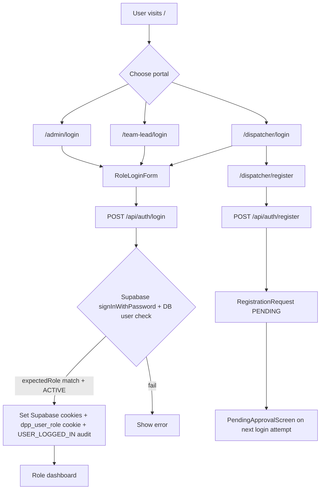
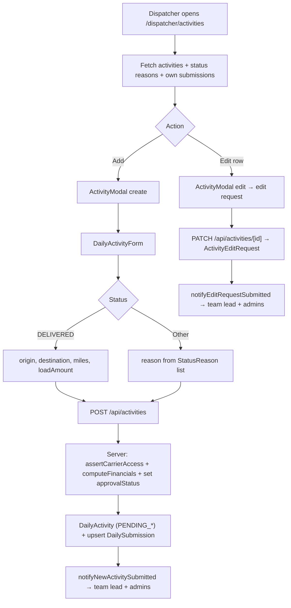
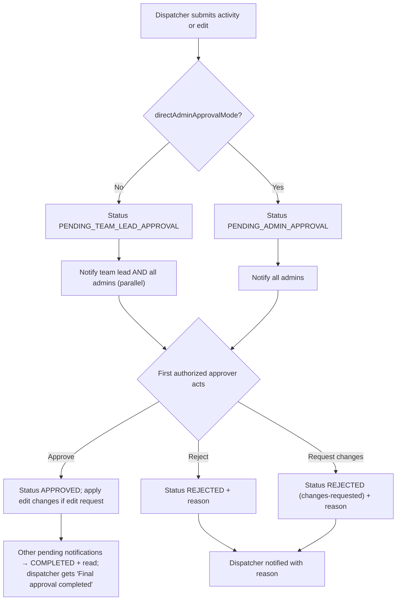
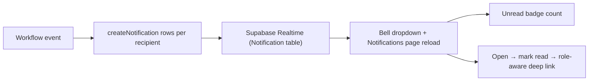
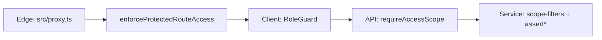
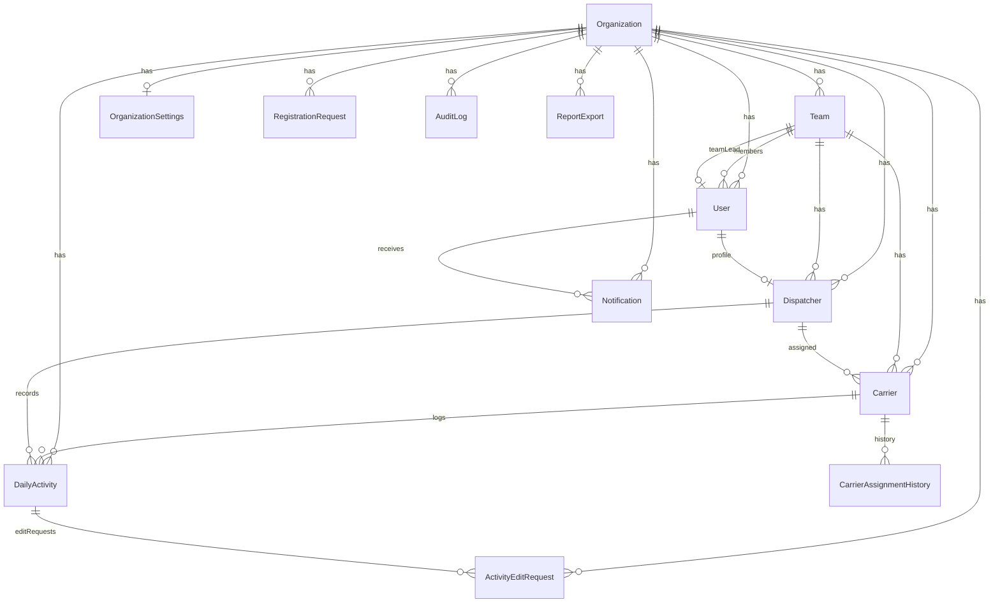

# Dispatcher Performance Platform — System Flow & Architecture

> **Document purpose:** Complete reference for developers, maintainers, and Cursor agents.  
> **Source of truth:** Codebase at `D:\Projects\dispatcher-performance-platform` as scanned on 2026-06-29.  
> **Rule:** Everything below is derived from implemented code. Gaps are listed in [§12 Unclear or Missing Information](#12-unclear-or-missing-information).

**Related docs:** [`docs/admin.md`](docs/admin.md) · [`docs/lead.md`](docs/lead.md) · [`docs/dispatcher.md`](docs/dispatcher.md) · [`docs/security-hardening.md`](docs/security-hardening.md) · [`docs/performance-audit-admin-login.md`](docs/performance-audit-admin-login.md)

---

## Table of Contents

1. [Project Overview](#1-project-overview)
2. [User Roles and Permissions](#2-user-roles-and-permissions)
3. [Complete System Flow](#3-complete-system-flow)
4. [UI and Page Flow](#4-ui-and-page-flow)
5. [Filters, Search, Sorting, and Data Views](#5-filters-search-sorting-and-data-views)
6. [Project Structure](#6-project-structure)
7. [Database Structure](#7-database-structure)
8. [API Flow](#8-api-flow)
9. [Feature Documentation](#9-feature-documentation)
10. [Authentication and Authorization](#10-authentication-and-authorization)
11. [Environment Variables and Setup](#11-environment-variables-and-setup)
12. [Unclear or Missing Information](#12-unclear-or-missing-information)
13. [Developer Notes](#13-developer-notes)

---

## 1. Project Overview

### What the platform does

The **Dispatcher Performance Platform (DPP)** is a multi-tenant SaaS web application for freight dispatch organizations. It tracks **daily load activities** per **carrier** (trucking company/driver), runs every dispatcher submission through an **approval workflow**, calculates **revenue**, **dispatch fees**, and **rate per mile**, and surfaces performance through **role-based dashboards**, **rankings**, **reports**, and **finance views**. Workflow events are pushed to users through an **in-app notification system** and recorded in an **audit log**.

### Problem it solves

Dispatch organizations need a single system to:

- Assign carriers to teams and dispatchers
- Log daily load outcomes (delivered, cancelled, not booked, not working)
- Review and approve dispatcher submissions and edits before they count
- Measure dispatcher and team performance
- Notify approvers and dispatchers of workflow events in real time
- Keep an immutable record of who did what (audit logs)
- Export financial and operational reports
- Onboard users with admin approval

### How each persona uses it

| Persona | In codebase | How they use the platform |
|---------|-------------|---------------------------|
| **Admin** | `UserRole.ADMIN` | Company-wide access: teams, dispatchers, carriers, activities, pending approvals, audit logs, notifications, rankings, reports, daily report, settings, user registration approvals, per-dispatcher finance |
| **Team Leader** | `UserRole.TEAM_LEAD` | Team-scoped access: monitor dispatchers, carriers, activities, pending approvals, notifications, rankings, and reports for their team; create/manage dispatchers and carriers on their team; approve team submissions |
| **Dispatcher** | `UserRole.DISPATCHER` | Personal scope: view assigned carriers, log daily activities (which enter approval), track submissions, receive notifications, view personal performance and finance, account summary |
| **Carrier** | *Not a login role* | **Business entity** (trucking company/driver record). Carriers do not sign in. They are managed by admins/team leads and appear in dispatcher activity forms |
| **Account / Finance user** | *Not a separate role* | Finance is a **feature area**, not a role. Dispatchers use `/dispatcher/finance`; admins use `/admin/dispatchers/[id]/finance`. All roles have an **Account** page for profile/session info |

### Technology stack

| Layer | Technology |
|-------|------------|
| Framework | Next.js 16 (App Router), React 19, TypeScript |
| Styling | Tailwind CSS 4, shadcn/ui (Base UI primitives) |
| Auth | Supabase Auth (`@supabase/ssr`), local JWT verification via `getClaims()` + cached JWKS |
| Database | PostgreSQL (hosted via Supabase) |
| ORM / schema | Prisma 7 (schema, migrations, generate, scripts) |
| Runtime DB access | Supabase service-role client (`src/lib/db/client.ts`) |
| Realtime | Supabase Realtime (`postgres_changes`) |
| Forms / validation | React Hook Form, Zod |
| Charts | Recharts |
| PDF | jsPDF + jspdf-autotable (activities); `window.print()` (finance) |
| CSV | Shared, hardened builder (`src/lib/utils/csv.ts`) with formula-injection protection |

---

## 2. User Roles and Permissions

### Implemented user roles

Only **three** roles exist in `prisma/schema.prisma` and `src/lib/constants/roles.ts`:

```text
ADMIN | TEAM_LEAD | DISPATCHER
```

### User statuses

| Status | Meaning | UI behavior |
|--------|---------|---------------|
| `ACTIVE` | Approved and can use the app | Full access per role |
| `PENDING_APPROVAL` | Registered, awaiting admin | `PendingApprovalScreen` |
| `INACTIVE` | Deactivated | `AccessDenied` screen |
| `INVITED` | Invitation not accepted | `AccessDenied` screen |

### Data scope model

| Role | Scope | `isCompanyWide` |
|------|-------|-----------------|
| Admin | Entire organization | `true` |
| Team Lead | Single `teamId` on user record | `false` |
| Dispatcher | Own `dispatcherId` + assigned carriers/activities | `false` |

Scope is built server-side in `src/server/auth/types.ts` (`buildAccessScope`) and client-side in `src/lib/role-scope.ts` (`buildRoleScopeFromSession`).

### Permission matrix

| Capability | Admin | Team Lead | Dispatcher |
|------------|:-----:|:---------:|:----------:|
| **View** company-wide data | ✓ | — | — |
| **View** team data | ✓ | ✓ (own team) | — |
| **View** own data | ✓ | ✓ | ✓ |
| **Teams** — list | ✓ | ✓ (scoped) | — |
| **Teams** — create/edit/deactivate | ✓ | — | — |
| **Dispatchers** — list | ✓ | ✓ (team) | — |
| **Dispatchers** — create (DISPATCHER role only via this form) | ✓ | ✓ (team only) | — |
| **Dispatchers** — edit / activate / deactivate | ✓ | ✓ (team) | — |
| **Dispatchers** — finance view | ✓ (`/admin/dispatchers/[id]/finance`) | — | — |
| **Carriers** — list | ✓ | ✓ (team) | ✓ (assigned only, read-only) |
| **Carriers** — create / edit / reassign / activate / deactivate | ✓ | ✓ (team) | — |
| **Activities** — list | ✓ | ✓ (team) | ✓ (own) |
| **Activities** — create (auto-approved) | ✓ | ✓ (team carriers) | — |
| **Activities** — create (enters approval) | — | — | ✓ (own carriers) |
| **Activities** — edit directly | ✓ | ✓ (own → admin approval) | — |
| **Activities** — edit via edit-request | — | — | ✓ (own carriers, enters approval) |
| **Activities** — approve / reject / request changes | ✓ | ✓ (team) | — |
| **Pending Approvals** page | ✓ | ✓ (team) | — |
| **My Submissions** page | — | — | ✓ |
| **Activities** — PDF export | ✓ | ✓ | ✓ |
| **Notifications** — view / mark read | ✓ | ✓ | ✓ |
| **Audit Logs** page + CSV export | ✓ | — | — |
| **Rankings** | ✓ | ✓ (team) | (dispatcher self-ranking via API) |
| **Reports** — view / CSV export | ✓ | ✓ (team) | — |
| **Daily Report** (admin live snapshot) | ✓ | — | — |
| **Settings** | ✓ | — | — |
| **User registration requests** — approve/reject | ✓ | — | — |
| **Self registration** | — | — | ✓ (creates pending request) |
| **Finance** — own loads/fees | — | — | ✓ |
| **Finance** — any dispatcher | ✓ | — | — |
| **Account** — profile / logout | ✓ | ✓ | ✓ |
| **Global search** | ✓ (scoped results) | ✓ | ✓ |

> **Team Lead creation note:** The "Create Dispatcher" form only offers the `DISPATCHER` role. New **Team Leads** are created through the **User Requests** approval flow (admin assigns the `TEAM_LEAD` role on approval) or via scripts — never by creating a `Dispatcher` row.

**Export summary**

| Export type | Admin | Team Lead | Dispatcher |
|-------------|:-----:|:---------:|:----------:|
| Reports CSV | ✓ | ✓ | — |
| Activities PDF | ✓ | ✓ | ✓ (incl. approval status column) |
| Audit Logs CSV | ✓ | — | — |
| Notifications | (view only) | (view only) | (view only) |
| Finance CSV | ✓ (per dispatcher) | — | ✓ (self) |
| Finance PDF | ✓ (print) | — | ✓ (print) |

**Delete behavior:** No hard-delete UI for core entities. Teams, dispatchers, and carriers use **soft delete** (`deletedAt`) and **deactivate** (`status` → `INACTIVE`). Activities are created/updated/approved/rejected; no delete endpoint exists. Edit requests and notifications are created/resolved, not deleted.

---

## 3. Complete System Flow

### 3.1 Login and authentication flow



**Steps:**

1. User lands on `/` and picks Admin, Team Lead, or Dispatcher portal.
2. `RoleLoginForm` posts to `POST /api/auth/login` with `{ email, password, expectedRole }`.
3. Server (`src/server/auth/auth.service.ts`): Supabase password sign-in → load `User` by `supabaseUserId` → verify email, role, `ACTIVE` status → write `USER_LOGGED_IN` audit log + `touchLastLogin`.
4. On success: Supabase session cookies + httpOnly `dpp_user_role` cookie set.
5. Client `SessionProvider` loads `GET /api/auth/me` once on mount → stores `SessionUser`.
6. `RoleGuard` in role layouts validates session before rendering `DashboardShell`.

**Session resolution (server):** `getCurrentUser()` (`src/server/auth/session.ts`) is wrapped in React `cache()` (deduped per request) and uses `supabase.auth.getClaims()` to verify the access token **locally** against a module-cached JWKS (`src/server/auth/jwks-cache.ts`), avoiding an auth-server round trip. Legacy symmetric (HS256) projects transparently fall back to a network `getUser()`.

**Password reset:**

1. `/auth/reset-password` → `POST /api/auth/forgot-password` → Supabase email.
2. User follows link → `/auth/callback` (code exchange) → `/auth/update-password`.
3. `POST /api/auth/update-password` (requires authenticated session). After update, the client re-reads the refreshed session and redirects to the correct role dashboard.

**Logout:**

- `POST /api/auth/logout` clears session → redirect to role login with `?loggedOut=1`.

---

### 3.2 Dashboard flow

| Role | Route | API | Data loaded |
|------|-------|-----|-------------|
| Admin | `/admin/dashboard` | `GET /api/dashboard/admin` | KPIs, growth, revenue trend, loads by team, status donut, top performers, recent activities |
| Team Lead | `/team-lead/dashboard` | `GET /api/dashboard/team-lead` | Team revenue, loads, dispatcher/carrier counts, activity overview table |
| Dispatcher | `/dispatcher/dashboard` | `GET /api/dashboard/dispatcher` | Personal revenue, delivered loads, avg rate/mile, assigned carriers, today completion, pending carriers, charts, recent activities |

Dashboards and detail/performance views read **approved** activities only (`approvalStatus = APPROVED`) so pending/rejected submissions never leak into summaries.

**Admin dashboard filter flow:** User adjusts filters → state updates → `router.replace` writes filters to URL → `useApiData` refetches → charts/tables re-render.

**Dispatcher dashboard:** `DispatcherFilterBar` → local state → refetch (URL not persisted).

---

### 3.3 Dispatcher daily activity flow (with approval)



**Rules (server):**

- One activity per carrier per date (`@@unique([carrierId, activityDate])`).
- Dispatcher can only log for carriers where `carrier.dispatcherId === scope.dispatcherId`.
- `DELIVERED` status computes `ratePerMile` and `dispatchFee` using org fee rules.
- Snapshots (carrier name, driver, team, fee %, truck type) stored on the activity row.
- **Approval status defaults to `APPROVED`** on the model. **Admin/Team-Lead-created** activities are live immediately. **Dispatcher-created** activities are saved as `PENDING_TEAM_LEAD_APPROVAL` (or `PENDING_ADMIN_APPROVAL` when `directAdminApprovalMode` is on).
- **Dispatcher edits** do not mutate the live row directly; they create an `ActivityEditRequest` (`proposedChanges` + `previousData`). The original activity stays live but is flagged `hasPendingEdit` in DTOs until resolved.

---

### 3.4 Approval workflow (parallel)



**Key behaviors (`approvals.service.ts`, `activities.service.ts`, `activity-edit-requests.service.ts`, `notifications.service.ts`):**

- **Parallel approval:** For dispatcher submissions, the assigned **team lead and all admins are notified simultaneously**; whichever authorized role acts **first finalizes** the item.
- **Team-lead-authored** submissions/edits route directly to **admin** approval (`resolveEditRequestApprovalStatus`: `TEAM_LEAD → PENDING_ADMIN_APPROVAL`).
- On final approval of an **edit request**, the `proposedChanges` are applied to the live `DailyActivity`; financials are recomputed where relevant.
- On finalization, sibling approval-required notifications for the same entity are flipped to `COMPLETED` and marked **read** (so they stop inflating unread badges), and the dispatcher receives a `COMPLETED` "Final approval completed" notification.
- Reject / request-changes set `REJECTED` with a reason and notify the dispatcher (`CHANGES_REQUESTED` vs `REJECTED`).
- Approvers act from the **Pending Approvals** page (table dropdown → View Details) or directly from a **notification deep link**; both open the same detail modal with Approve / Reject / Request changes / Close actions.

---

### 3.5 Notifications flow



- **Recipients:** team lead + admins for approval requests; dispatcher for outcomes/finalization.
- **Surfaces:** `NotificationsDropdown` (top nav bell, unread badge, optional beep via `useNotificationSound`) and the full `/{role}/notifications` page.
- **Deep links:** `getNotificationHref()` routes each notification to the correct page by role (pending approvals for approvers, submissions for dispatchers) with `?activityId=` / `?editRequestId=` query params that auto-open the detail modal.
- **Read state:** `markNotificationRead`, `markAllNotificationsRead`; `countUnreadNotifications` powers the badge. Auto-completed approval notifications are marked read.
- **Realtime:** `useRealtimeRefresh(["Notification", "DailyActivity", "ActivityEditRequest"])`.

---

### 3.6 Carrier creation and detail view flow

**Create (Admin / Team Lead):**

1. `/admin/carriers` or `/team-lead/carriers` → **Create Carrier** button.
2. `CarrierModal` → `CarrierForm` (`carrierName`, `driverName`, `mcNumber`, `truckType`, team, dispatcher, dispatch fee %, **notes**) → `POST /api/carriers`.
3. Server validates team access, creates `Carrier`, writes `AuditLog`, optionally `CarrierAssignmentHistory`.

**Dispatcher view (read-only):**

1. `/dispatcher/carriers` (`compact` mode) — excel-style filters, no create button, `readOnly` table.

**Detail view:**

- Detail panels live inside modals (`CarrierDetailView`, `DispatcherDetailView`, `ActivityDetailView`, `TeamDetailView`).
- `CarrierDetailView` shows the carrier profile (incl. `notes`) plus a **Daily Activity History** table of approved activities. *(The per-view activity filter controls were removed; the history loads with a default last-30-days approved scope.)*

**Reassign:**

- `CarrierModal` reassign mode → `POST /api/carriers/[id]/reassign` with `{ teamId, dispatcherId, notes? }`.

---

### 3.7 Team leader view flow

1. Team Lead logs in at `/team-lead/login`.
2. All list APIs apply `teamScopeFilter` / `carrierScopeFilter` server-side.
3. Team Lead manages dispatchers and carriers on their team, and reviews **Pending Approvals** + **Notifications** for their team.
4. Team Lead cannot access Settings, Daily Report, User Requests, Audit Logs, or admin-only finance routes.
5. Rankings and Reports are team-scoped via the same filter/assertion layer.

---

### 3.8 Admin management flow

| Area | Flow |
|------|------|
| **Teams** | Create → assign team lead user → activate/deactivate |
| **Dispatchers** | Create with temp password dialog → assign team (DISPATCHER role) |
| **User requests** | Review pending registrations → approve (assign role incl. TEAM_LEAD + team + temp password) or reject |
| **Pending approvals** | Review dispatcher submissions/edits → approve / reject / request changes |
| **Audit logs** | Filter/search the full action history → export CSV |
| **Settings** | Edit dispatch fee rules, truck types, timezone, currency, CSV defaults, status reasons, **direct admin approval mode** |
| **Daily report** | Select date/filters → live metrics + `LiveActivityTable` with Supabase realtime |

---

### 3.9 Account / finance flow

| User | Entry | API |
|------|-------|-----|
| Dispatcher | `/dispatcher/finance` or account summary link | `GET /api/dispatcher/finance` |
| Admin | Dispatchers table → Finance action → `/admin/dispatchers/[id]/finance` | `GET /api/admin/dispatchers/[id]/finance` |

**Finance page shows:** profile card, summary metrics (revenue, fees, loads, avg rate), load history table, carrier breakdown table.

**Export:** CSV via POST export routes; PDF via browser print (`window.print()`), not generated PDF bytes.

---

### 3.10 Reports flow

1. Admin or Team Lead opens `/admin/reports` or `/team-lead/reports`.
2. Select period tab: Daily, Weekly, Monthly, Historical, Custom.
3. Apply `ReportFilterBar` (date range, team, dispatcher, carrier, status).
4. `GET /api/reports?period=...` returns summary metrics + four breakdown tables.
5. **Export CSV** → `POST /api/reports/export` → client blob download.
6. Server logs `ReportExport` record + `REPORT_EXPORTED` audit entry. CSV cells are escaped against formula injection (`src/lib/utils/csv.ts`).

---

### 3.11 PDF / export flow

| Export | Mechanism | Location |
|--------|-----------|----------|
| Activities PDF | Client-side jsPDF (optional approval column for dispatcher view) | `src/lib/reports/export-daily-activities-pdf.ts` |
| Reports CSV | Server (shared csv builder) | `src/server/services/reports.service.ts` |
| Audit Logs CSV | Client-side (shared csv builder) | `src/components/admin/admin-logs-page-content.tsx` |
| Finance CSV | Server (shared csv builder) | `src/server/services/dispatcher-finance.service.ts` |
| Finance PDF | `window.print()` | `dispatcher-finance-page-content.tsx` |

CSV row cap: `OrganizationSettings.csvMaxRows` (default 10,000). All CSV builders share `escapeCsvCell` / `buildCsv` with formula-injection guards (`=`, `+`, `-`, `@`, tab, CR).

---

### 3.12 Filter / search / sort flow

See [§5](#5-filters-search-sorting-and-data-views) for full detail.

**Summary:** Filters are page-local state or URL params. Global search (top nav) debounces 300ms, min 2 chars, calls `GET /api/search?q=`. The Notifications page has its own client-side search + status/carrier/date filters + pagination. Rankings/reports sort server-side; data tables are not interactively sortable.

---

### 3.13 Refresh / reload data flow

| Mechanism | Where used |
|-----------|------------|
| Manual **Refresh** button | Admin dashboard, admin daily report, dispatcher dashboard |
| `useApiData` → `reload()` | All data pages on retry/error; stale-response guarded by a monotonic request id |
| `useRealtimeRefresh` | Activities, carriers, teams, user requests, **pending approvals, notifications, edit requests** (Supabase `postgres_changes`, unique channel id per hook, debounced reload) |
| `useDailyReportRealtime` | Admin daily report (`DailyActivity` changes) |
| Full page reload | Resets non-URL-persisted filters to defaults |

---

### 3.14 Role-based access flow



1. **Edge** (`src/proxy.ts` → `src/lib/supabase/middleware.ts`): cookie/session refresh (skipped for `/api/*` without auth cookies); redirect unauthenticated users to role login; redirect wrong-role users to their dashboard.
2. **Client** (`RoleGuard`): session status screens; wrong-role redirect.
3. **API** (`requireAccessScope`, `assertTeamAccess`, `assertDispatcherAccess`): 401/403 JSON errors.
4. **Services** (`scope-filters.ts`): Supabase queries filtered by org + team/dispatcher.

---

### 3.15 Error / loading / empty-state flow

`PageContentGate` (`src/components/feedback/page-content-gate.tsx`) drives all list/dashboard pages:

| State | Component | Trigger |
|-------|-----------|---------|
| `loading` | `LoadingState` | `useApiData.isLoading` |
| `error` | `ErrorState` + Retry | API failure |
| `empty` | `EmptyState` + optional action | Zero rows after scope filter |
| `ready` | Page content | Data present |

Toasts (`AppToast`) show success/error for mutations. A root `src/app/global-error.tsx` boundary catches render failures.

API envelope: `{ ok: true, data }` or `{ ok: false, error }` (`src/server/api/response.ts`).

401 from client: retry → `fetchSession` → redirect to login `?expired=1` or `/session-expired`.

---

## 4. UI and Page Flow

### 4.1 Page inventory

#### Public

| URL | File | Purpose |
|-----|------|---------|
| `/` | `src/app/page.tsx` | Portal picker (3 sign-in cards) |
| `/session-expired` | `src/app/session-expired/page.tsx` | Expired session screen |
| `/auth/reset-password` | `src/app/auth/reset-password/page.tsx` | Forgot password form |
| `/auth/update-password` | `src/app/auth/update-password/page.tsx` | Set new password |
| `/auth/callback` | `src/app/auth/callback/route.ts` | OAuth/code handler |

#### Admin (`/admin/*`)

| URL | Component | Access |
|-----|-----------|--------|
| `/admin/login` | `RoleLoginForm` | Public |
| `/admin/dashboard` | `AdminDashboardPage` | Admin |
| `/admin/teams` | `TeamsPageContent` | Admin |
| `/admin/dispatchers` | `DispatchersPageContent` | Admin |
| `/admin/dispatchers/[id]/finance` | `DispatcherFinancePageContent` (admin) | Admin |
| `/admin/carriers` | `CarriersPageContent` | Admin |
| `/admin/activities` | `ActivitiesPageContent` | Admin |
| `/admin/activities/pending` | `PendingApprovalsPageContent` | Admin |
| `/admin/logs` | `AdminLogsPageContent` | Admin |
| `/admin/notifications` | `NotificationsPageContent` | Admin |
| `/admin/rankings` | `RankingsPageContent` | Admin |
| `/admin/reports` | `ReportsPageContent` | Admin |
| `/admin/daily-report` | `AdminDailyReportPage` | Admin |
| `/admin/settings` | `SettingsPageContent` | Admin |
| `/admin/users/requests` | `UserRequestsPageContent` | Admin |
| `/admin/account` | `AccountPageContent` | Admin |

#### Team Lead (`/team-lead/*`)

| URL | Component | Access |
|-----|-----------|--------|
| `/team-lead/login` | `RoleLoginForm` | Public |
| `/team-lead/dashboard` | `TeamLeadDashboardPage` | Team Lead |
| `/team-lead/dispatchers` | `DispatchersPageContent` | Team Lead |
| `/team-lead/carriers` | `CarriersPageContent` | Team Lead |
| `/team-lead/activities` | `ActivitiesPageContent` | Team Lead |
| `/team-lead/activities/pending` | `PendingApprovalsPageContent` | Team Lead |
| `/team-lead/notifications` | `NotificationsPageContent` | Team Lead |
| `/team-lead/rankings` | `RankingsPageContent` | Team Lead |
| `/team-lead/reports` | `ReportsPageContent` | Team Lead |
| `/team-lead/account` | `AccountPageContent` | Team Lead |

#### Dispatcher (`/dispatcher/*`)

| URL | Component | Access |
|-----|-----------|--------|
| `/dispatcher/login` | `RoleLoginForm` | Public |
| `/dispatcher/register` | `DispatcherRegisterForm` | Public |
| `/dispatcher/dashboard` | `DispatcherDashboardPage` | Dispatcher |
| `/dispatcher/carriers` | `CarriersPageContent` (compact, read-only) | Dispatcher |
| `/dispatcher/activities` | `ActivitiesPageContent` (compact) | Dispatcher |
| `/dispatcher/activities/submissions` | `DispatcherSubmissionsPageContent` | Dispatcher |
| `/dispatcher/notifications` | `NotificationsPageContent` | Dispatcher |
| `/dispatcher/performance` | `DispatcherPerformancePage` | Dispatcher |
| `/dispatcher/finance` | `DispatcherFinancePageContent` | Dispatcher |
| `/dispatcher/account` | `AccountPageContent` + finance summary | Dispatcher |

**No `loading.tsx` / `error.tsx` route segments exist**, but a global `global-error.tsx` boundary is present. Most authenticated pages set `export const dynamic = "force-dynamic"`.

---

### 4.2 Shared layout shell

All authenticated role pages use:

```text
RoleProtectedLayout → AppProviders → RoleGuard → DashboardShell
  ├── AppSidebar (role nav from roles.ts, exact-path active matching)
  ├── TopNav (global search, notifications bell, account link)
  └── MainContent (page children)
```

`AppProviders` (session + entity options) are mounted per-role layout.

---

### 4.3 UI elements by page type

| Page type | Cards | Tables | Buttons | Modals | Filters | Export | Refresh |
|-----------|:-----:|:------:|:-------:|:------:|:-------:|:------:|:-------:|
| Admin dashboard | KPI, metric, chart cards | Recent activities | Refresh, Export Report, filter popover | — | Date, team, dispatcher, carrier, truck, status | Link to reports | ✓ |
| Team dashboard | 4 metric cards | Team activity overview | — | — | — | — | — |
| Dispatcher dashboard | Metric, completion, pending cards | Carrier performance, recent activities | Refresh | — | Date, status, carrier, truck | — | ✓ |
| Teams | — | TeamsTable | Create Team | TeamModal | — | — | Realtime |
| Dispatchers | — | DispatchersTable | Create Dispatcher | DispatcherModal, credentials dialog | EntityFilterBar | Finance action (admin) | — |
| Carriers | — | CarriersTable | Create (non-dispatcher) | CarrierModal (incl. notes) | Entity or Excel filters | — | Realtime |
| Activities | — | ActivitiesTable (approval badges) | Add Activity | ActivityModal (detail view) | Entity or Excel filters (incl. approval status for dispatcher) | PDF | Realtime |
| Pending Approvals | — | Pending items table | View / Approve / Reject / Request changes | Detail modal (full activity + edit comparison) | — | — | Realtime |
| My Submissions | — | Submissions table | View | Detail modal | — | — | Realtime |
| Notifications | — | Notifications table (badges, 2-line dates) | Mark all as read, Open | — | Search, status, carrier, date | — | Realtime + pagination |
| Audit Logs | — | Logs table | Export CSV | — | Search, user, role, action, module, status, date | CSV | — |
| Rankings | Metric summary | RankingsTable | Tab: dispatchers/carriers/teams | — | Team, dispatcher | — | — |
| Reports | Summary metrics | 4 report tables | Period tabs, Export CSV | — | ReportFilterBar | CSV | — |
| Daily report | 9 metric cards | LiveActivityTable | — | — | DailyReportFilterBar | — | ✓ + realtime |
| Settings | Settings cards | — | Save | — | — | — | — |
| User requests | — | Requests table | Approve/Reject | View, approve, reject, credentials dialogs | — | — | Realtime |
| Finance | Profile, summary cards | Load + carrier tables | Export CSV, Print PDF | — | FinanceFilterBar | CSV + print | — |
| Performance | 8 metric cards | Carriers preview (top 5) | — | — | — | — | — |
| Account | Profile card | — | Logout | — | — | — | — |

---

### 4.4 Navigation map

```mermaid
flowchart TB
  subgraph admin [Admin Sidebar]
    AD[Dashboard] --> AT[Teams] --> ADp[Dispatchers] --> AC[Carriers]
    AC --> AA[Activities] --> APA[Pending Approvals] --> ALg[Audit Logs]
    ALg --> ANo[Notifications] --> ARk[Rankings] --> ARp[Reports]
    ARp --> ADr[Daily Report] --> AS[Settings] --> AUR[User Requests] --> AAcc[Account]
  end

  subgraph lead [Team Lead Sidebar]
    LD[Dashboard] --> LDp[Dispatchers] --> LC[Carriers] --> LA[Activities]
    LA --> LPA[Pending Approvals] --> LNo[Notifications] --> LRk[Rankings]
    LRk --> LRp[Reports] --> LAcc[Account]
  end

  subgraph dispatcher [Dispatcher Sidebar]
    DD[Dashboard] --> DC[My Carriers] --> DA[Daily Activities] --> DS[My Submissions]
    DS --> DNo[Notifications] --> DP[My Performance] --> DF[Finance] --> DAcc[Account]
  end
```



**Sidebar active state:** exact-path matching (`isNavItemActive` normalizes the path and ignores query params) so only the current page is highlighted (e.g. Pending Approvals does not also highlight Activities).

**Global search** (`global-search.tsx`): navigates to the role-appropriate list page with `?q=` or entity-specific query params.

**Legacy redirects** (`next.config.ts`): `/teams` → `/admin/teams`, `/dashboard/admin` → `/admin/dashboard`, etc.

---

## 5. Filters, Search, Sorting, and Data Views

### 5.1 Filter defaults

| Context | Default `dateRange` | Other defaults | Config file |
|---------|---------------------|----------------|-------------|
| Entity filters (activities, dispatchers, rankings) | `last-30-days` | All IDs = `all` | `entity-filter-params.ts` |
| Admin dashboard | `this-month` | Empty multi-selects | `admin-dashboard-filters.ts` |
| Activity excel (compact) | `last-30-days` | Empty arrays (incl. approval statuses) | `activity-excel-filter-params.ts` |
| Carrier excel (compact) | — | Empty arrays | `carrier-excel-filter-params.ts` |
| Dispatcher dashboard | `this-month` | All `all` | `dispatcher-filter-params.ts` |
| Finance | `this-month` | carrier/status `all` | `finance-filter-params.ts` |
| Reports | `today` | All `all` | `report-filter-params.ts` |
| Daily report | **Today's date** | team/dispatcher/status `all` | `daily-report-filter-params.ts` |
| Notifications | — (no date by default) | search empty, status/carrier `all` | page-local state |

Date presets: `src/lib/constants/date-ranges.ts`, `finance-date-ranges.ts`.

---

### 5.2 Filter types by page

| Filter | Pages | Parameters |
|--------|-------|------------|
| **Date range** | Dashboards, activities, reports, finance, daily report, rankings (via entity bar) | `dateRange`, `dateFrom`, `dateTo` |
| **Team** | Admin dashboard, entity bar, reports, daily report, rankings | `teamId` |
| **Dispatcher** | Admin dashboard, entity bar, reports, daily report, rankings | `dispatcherId` |
| **Carrier** | Admin dashboard, entity bar, reports, dispatcher dashboard, finance, notifications | `carrierId` / carrier name |
| **Truck type** | Admin dashboard, entity bar, carrier excel | `truckType` |
| **Status** | Admin dashboard, entity bar, reports, daily report, finance, activities | `status` / `statuses[]` |
| **Approval status** | Dispatcher activities (excel), pending approvals | `approvalStatus` / `approvalStatuses[]` |
| **Notification status / search / date** | Notifications page | client-side |
| **Audit action / module / status / role / user / date / search** | Audit logs page | query params on `/api/admin/logs` |
| **Search `q`** | Dispatchers, carriers, activities APIs | `q` (backend ILIKE) |
| **Report period** | Reports | `period`: DAILY, WEEKLY, MONTHLY, HISTORICAL, CUSTOM |

Server-side date inputs reject calendar-invalid dates (e.g. `2026-02-31`).

**Excel-style filters (compact pages):** Multi-select checkbox popovers for team, dispatcher, carrier, truck type, status, and (dispatcher) approval status, with client-side option search.

---

### 5.3 Search

| Search | UI location | Min chars | Behavior |
|--------|-------------|-----------|----------|
| Global search | Top nav | 2 | Debounce 300ms, `GET /api/search`, max 8 results per group (carriers, dispatchers, activities) |
| Notifications search | Notifications page | — | Client-side match on title/message/carrier |
| Audit logs search | Audit logs page | — | Server query on `/api/admin/logs` |
| List `q` param | API only (no EntityFilterBar input) | — | ILIKE on name/email/MC/origin/destination |
| Excel filter popovers | Compact filter controls | — | Client-side filter within option lists |

---

### 5.4 Sorting

- **No client-side column sorting** in tables.
- `@tanstack/react-table` is in `package.json` but **not imported** in `src/`.
- Server-side sort in: `rankings.service.ts`, `reports.service.ts`, `admin-dashboard.service.ts`, `audit-logs.service.ts`, `notifications.service.ts` (newest first).

---

### 5.5 Pagination

- **Notifications page:** client-side pagination (8 per page) with Previous/Next + page indicator.
- **Notifications API:** capped at the most recent 100 rows server-side.
- **Other list endpoints:** return full filtered result sets (no pagination).
- CSV exports capped by `csvMaxRows` (default 10,000).

---

### 5.6 URL persistence on refresh

| Page | Reads URL on load | Writes URL on Apply |
|------|:-----------------:|:-------------------:|
| Admin dashboard | ✓ | ✓ |
| Activities, carriers, dispatchers | ✓ | ✗ |
| Pending approvals, submissions (deep link) | ✓ (`activityId`/`editRequestId`) | clears on action |
| Rankings, reports, finance, daily report, dispatcher dashboard, notifications | ✗ | ✗ |
| Global search | ✗ | ✗ |

After full page reload, non-URL pages reset filters to code defaults.

---

## 6. Project Structure

```text
dispatcher-performance-platform/
├── prisma/
│   ├── schema.prisma          # Data model (source of truth for tables)
│   └── migrations/            # SQL migrations (init, approval workflow, edit
│                              #   requests + notifications, carrier notes,
│                              #   performance indexes, audit user login)
├── scripts/
│   ├── bootstrap.ts           # Seed org, settings, status reasons
│   ├── build.mjs / next-build.mjs  # Build wrappers (Windows path-casing safe)
│   ├── seed-demo-data.ts
│   ├── sync-auth-user.ts
│   ├── reset-user-password.ts
│   └── create-admin-user.ts
├── docs/                      # Role guides + security/perf notes
├── src/
│   ├── app/                   # Next.js App Router (pages + API)
│   │   ├── admin/             # Admin portal (incl. activities/pending, logs, notifications)
│   │   ├── team-lead/         # Team lead portal (incl. activities/pending, notifications)
│   │   ├── dispatcher/        # Dispatcher portal (incl. activities/submissions, notifications)
│   │   ├── auth/              # Password reset pages + callback
│   │   ├── api/               # REST API route handlers
│   │   └── global-error.tsx   # Root error boundary
│   ├── components/
│   │   ├── activities/        # Activities page, excel filters, PDF button, approval badge,
│   │   │                      #   pending approvals, submissions, pending-activities
│   │   ├── account/           # Account + dispatcher finance summary
│   │   ├── admin/             # User requests, audit logs page
│   │   ├── auth/              # Login, guard, session, register, update-password
│   │   ├── carriers/          # Carriers page + excel filters
│   │   ├── daily-report/      # Admin daily report
│   │   ├── dashboard/         # Role-specific dashboard widgets
│   │   ├── dashboards/        # Full dashboard page compositions
│   │   ├── details/           # Entity detail views (incl. activity change comparison)
│   │   ├── dispatchers/       # Dispatchers page
│   │   ├── feedback/          # Loading, empty, error, toast, gate
│   │   ├── filters/           # Shared filter bars and fields
│   │   ├── finance/           # Finance page + tables + export
│   │   ├── forms/             # RHF forms for entities
│   │   ├── layout/            # Shell, sidebar, nav, search
│   │   ├── modals/            # Entity CRUD + activity detail modals
│   │   ├── notifications/     # Notifications dropdown + page
│   │   ├── providers/         # Session + entity options
│   │   ├── rankings/          # Rankings page
│   │   ├── reports/           # Reports page
│   │   ├── settings/          # Settings page + form
│   │   ├── tables/            # Data tables per entity
│   │   └── ui/                # shadcn/Base UI primitives
│   ├── hooks/                 # useApiData, useRoleScope, realtime, notification sound
│   ├── lib/
│   │   ├── api/               # HTTP client + resource functions
│   │   ├── audit/             # Audit-log formatting helpers
│   │   ├── auth/              # Roles, nav items, permissions, session types
│   │   ├── constants/         # Enums, labels, filter options (incl. activity-approval, notifications)
│   │   ├── dashboard/         # Dashboard filter param builders
│   │   ├── db/                # Supabase DB client + table names + types
│   │   ├── errors/            # Typed errors
│   │   ├── filters/           # URL/state filter parsing
│   │   ├── notifications/     # Notification deep-link helpers (+ tests)
│   │   ├── reports/           # PDF export + metrics + filter labels
│   │   ├── supabase/          # Auth clients + middleware helpers
│   │   ├── utils/             # Calculations, formatting, date ranges, csv
│   │   └── validation/        # Zod schemas for forms
│   ├── server/
│   │   ├── api/               # Request/response helpers
│   │   ├── auth/              # Session (getClaims + React.cache), jwks-cache, require-auth, auth.service
│   │   ├── mappers/           # DB row → DTO mappers
│   │   ├── services/          # Business logic per domain (incl. approvals, notifications,
│   │   │                      #   activity-edit-requests, audit-logs, daily-submissions)
│   │   └── utils/             # Scope filters, approval-workflow, rate limit, security
│   ├── generated/prisma/      # Generated Prisma client (gitignored)
│   └── proxy.ts               # Edge middleware entry (session + route guard)
├── .env.example
├── next.config.ts             # Redirects, Windows path normalization, Prisma tracing
├── package.json
└── tsconfig.json
```

---

## 7. Database Structure

### 7.1 Database technology

| Aspect | Implementation |
|--------|----------------|
| Engine | PostgreSQL (Supabase-hosted) |
| Schema management | Prisma (`prisma/schema.prisma`, migrations) |
| Runtime queries | Supabase JS service-role client (`src/lib/db/client.ts`) |
| Auth users | Supabase Auth (`supabaseUserId` on `User`) |
| Row Level Security | **Not defined in this codebase** — access control is application-layer (see `docs/security-hardening.md` for RLS recommendations) |

Connection env vars: `DATABASE_URL`, `DIRECT_URL`.

---

### 7.2 Tables and relationships



#### Core tables

| Table | Purpose | Key fields |
|-------|---------|------------|
| `Organization` | Tenant | `name`, `slug`, `timezone`, `currency`, `deletedAt` |
| `User` | Login identity | `email`, `fullName`, `role`, `status`, `teamId`, `supabaseUserId`, `lastLoginAt` |
| `Team` | Dispatch team | `name`, `teamLeadUserId`, `status` |
| `Dispatcher` | Dispatcher profile | `userId`, `teamId`, `status` |
| `Carrier` | Trucking company/driver | `carrierName`, `driverName`, `mcNumber`, `truckType`, `teamId`, `dispatcherId`, `dispatchFeePercentage`, `status`, **`notes`** |
| `DailyActivity` | Daily load record | `activityDate`, `carrierId`, `dispatcherId`, `teamId`, `status`, snapshots, `origin`, `destination`, `totalMiles`, `loadAmount`, `ratePerMile`, `dispatchFee`, `reason`, `notes`, **`approvalStatus`**, **`approvalType`**, **`submittedById`**, **`teamLeadApprovedById`**, **`adminApprovedById`**, **`rejectedById`**, **`rejectionReason`**, **`approvalNotes`**, **`submittedAt`/`teamLeadApprovedAt`/`adminApprovedAt`/`rejectedAt`** |
| `ActivityEditRequest` | Pending edit to an activity | `originalActivityId`, `teamId`, `dispatcherId`, `approvalStatus`, `proposedChanges` (JSON), `previousData` (JSON), approver/submitter ids + timestamps, `rejectionReason`, `approvalNotes` |
| `Notification` | In-app notification | `recipientUserId`, `title`, `message`, `notificationStatus`, `activityId?`, `editRequestId?`, `metadata` (JSON), `readAt` |
| `DailySubmission` | Daily entry completion tracker | `dispatcherId`, `submissionDate`, `carrierCount`, `activityCount` |
| `CarrierAssignmentHistory` | Reassignment audit trail | `carrierId`, `teamId`, `dispatcherId`, snapshots, `assignedAt`, `unassignedAt` |
| `StatusReason` | Org-specific cancel/not-booked reasons | `label`, `isActive`, `sortOrder` |
| `OrganizationSettings` | Fee rules, CSV defaults, truck types | `defaultDispatchFeePercent`, `minimumDispatchFee`, `roundToNearestDollar`, `allowedTruckTypes`, `csvMaxRows`, **`directAdminApprovalMode`**, etc. |
| `RegistrationRequest` | Self-registration queue | `email`, `requestedRole`, `preferredTeamId`, `assignedRole`, `assignedTeamId`, `status` |
| `AuditLog` | Immutable action log | `actorUserId`, `action`, `entityType`, `entityId`, `metadata` |
| `ReportExport` | Export job record | `reportType`, `period`, `filters`, `status`, `rowCount` |

#### Enums

| Enum | Values |
|------|--------|
| `UserRole` | ADMIN, TEAM_LEAD, DISPATCHER |
| `UserStatus` | ACTIVE, PENDING_APPROVAL, INACTIVE, INVITED |
| `TeamStatus` / dispatcher status | ACTIVE, INACTIVE |
| `CarrierStatus` | ACTIVE, INACTIVE |
| `LoadActivityStatus` | DELIVERED, CANCELLED, NOT_BOOKED, NOT_WORKING |
| `TruckType` | DRY_VAN, REEFER, FLATBED, BOX_TRUCK, HOTSHOT, POWER_ONLY, CARGO_VAN |
| `RegistrationRequestStatus` | PENDING, APPROVED, REJECTED |
| `ReportExportStatus` | PENDING, COMPLETED, FAILED |
| **`ActivityApprovalStatus`** | APPROVED, PENDING_TEAM_LEAD_APPROVAL, PENDING_ADMIN_APPROVAL, REJECTED |
| **`ActivityApprovalType`** | NEW_ACTIVITY, EDIT_ACTIVITY |
| **`NotificationStatus`** | PENDING, APPROVED, REJECTED, CHANGES_REQUESTED, ADMIN_APPROVAL_REQUIRED, TEAM_LEAD_APPROVAL_REQUIRED, COMPLETED |
| `AuditAction` | USER_APPROVED, USER_REJECTED, USER_ROLE_ASSIGNED, USER_TEAM_ASSIGNED, **USER_LOGGED_IN**, TEAM_*, DISPATCHER_*, CARRIER_* (incl. CARRIER_REASSIGNED), ACTIVITY_CREATED/UPDATED/**SUBMITTED**/**APPROVED_BY_TEAM_LEAD**/**APPROVED_BY_ADMIN**/**REJECTED**/**PENDING_UPDATED**, SETTINGS_UPDATED, REPORT_EXPORTED |

#### Key constraints & indexes

- `User`: unique `(organizationId, email)`, unique `supabaseUserId`
- `Carrier`: unique `(organizationId, mcNumber)`
- `DailyActivity`: unique `(carrierId, activityDate)`; indexes on `(organizationId, approvalStatus)`, `(teamId, approvalStatus)`, plus date/status indexes
- `ActivityEditRequest`: indexes on `(organizationId|originalActivityId|teamId|dispatcherId, approvalStatus)`
- `Notification`: indexes on `(recipientUserId, readAt, createdAt)`, `(organizationId, createdAt)`
- `DailySubmission`: unique `(dispatcherId, submissionDate)`
- Soft delete: `deletedAt` on Organization, User, Team, Dispatcher, Carrier

---

### 7.3 Data flow: frontend → API → database

```text
Page component
  → useApiData / form submit
  → lib/api/resources.ts (apiFetch)
  → app/api/*/route.ts (handleApi wrapper)
  → requireAccessScope() + service layer
  → db().from(T.Table) — Supabase service role
  → PostgreSQL
```

Mutations also call `writeAuditLog()` and, for workflow events, the notification service.

**Prisma client** is used in `scripts/*` and `prisma generate` / build, not in runtime API services.

---

## 8. API Flow

**Base URL:** `/api`  
**Auth:** Session cookies (Supabase) on all protected routes unless noted.  
**Response shape:** `{ ok: true, data: T }` | `{ ok: false, error: string }`

### 8.1 Auth

| Route | Method | Purpose | Body / query | Roles |
|-------|--------|---------|--------------|-------|
| `/api/auth/login` | POST | Sign in (+ `USER_LOGGED_IN` audit) | `{ email, password, expectedRole }` | Public |
| `/api/auth/logout` | POST | Sign out | — | Public |
| `/api/auth/me` | GET | Current session user | — | Public (null if unauthenticated) |
| `/api/auth/register` | POST | Self-register dispatcher | `{ fullName, email, phoneNumber, preferredTeamId?, notes? }` | Public |
| `/api/auth/forgot-password` | POST | Send reset email | `{ email }` | Public |
| `/api/auth/update-password` | POST | Set password | `{ password }` | Authenticated |

### 8.2 Health

| Route | Method | Purpose |
|-------|--------|---------|
| `/api/health` | GET | Liveness |
| `/api/health/ready` | GET | Env + DB connectivity check |

### 8.3 Public data

| Route | Method | Purpose | Callers |
|-------|--------|---------|---------|
| `/api/public/teams` | GET | Active team list for registration | `dispatcher-register-form.tsx` |

### 8.4 Teams

| Route | Method | Auth | Purpose |
|-------|--------|------|---------|
| `/api/teams` | GET | Scoped | List teams |
| `/api/teams` | POST | Admin | Create team |
| `/api/teams/[id]` | PATCH | Admin | Update team |

### 8.5 Dispatchers

| Route | Method | Auth | Purpose |
|-------|--------|------|---------|
| `/api/dispatchers` | GET | Scoped | List (`?q, teamId, dispatcherId`) |
| `/api/dispatchers` | POST | Admin / Team Lead | Create dispatcher user |
| `/api/dispatchers/[id]` | PATCH | Admin / Team Lead | Update |
| `/api/dispatchers/[id]` | POST | Admin / Team Lead | `{ action: "activate" \| "deactivate" }` |

### 8.6 Carriers

| Route | Method | Auth | Purpose |
|-------|--------|------|---------|
| `/api/carriers` | GET | Scoped | List with filters |
| `/api/carriers` | POST | Admin / Team Lead | Create (incl. notes) |
| `/api/carriers/[id]` | PATCH | Admin / Team Lead | Update |
| `/api/carriers/[id]/reassign` | POST | Admin / Team Lead | Reassign team/dispatcher |

### 8.7 Activities & approval

| Route | Method | Auth | Purpose |
|-------|--------|------|---------|
| `/api/activities` | GET | Scoped | List with activity + approval filters |
| `/api/activities` | POST | Scoped | Create daily activity (dispatcher → pending) |
| `/api/activities/[id]` | PATCH | Scoped | Update activity (dispatcher → creates edit request) |
| `/api/activities/[id]/approve` | POST | Admin / Team Lead | Approve a new-activity submission |
| `/api/activities/[id]/reject` | POST | Admin / Team Lead | Reject / request changes |
| `/api/activities/pending` | GET | Admin / Team Lead | Pending approval items (activities + edit requests) |
| `/api/activities/submissions` | GET | Dispatcher | Own submissions (with statuses + edit requests) |
| `/api/activity-edit-requests/[id]/approve` | POST | Admin / Team Lead | Approve an edit request (applies changes) |
| `/api/activity-edit-requests/[id]/reject` | POST | Admin / Team Lead | Reject / request changes on an edit |

### 8.8 Notifications

| Route | Method | Auth | Purpose |
|-------|--------|------|---------|
| `/api/notifications` | GET | Scoped | Recipient's notifications (newest 100) + unread count |
| `/api/notifications/[id]/read` | POST | Scoped | Mark one notification read |
| `/api/notifications/read-all` | POST | Scoped | Mark all read |

### 8.9 Dashboards

| Route | Method | Role | Purpose |
|-------|--------|------|---------|
| `/api/dashboard/admin` | GET | Admin | Admin dashboard bundle |
| `/api/dashboard/team-lead` | GET | Team Lead | Team dashboard metrics |
| `/api/dashboard/dispatcher` | GET | Dispatcher | Dispatcher dashboard bundle |

### 8.10 Admin-specific

| Route | Method | Role | Purpose |
|-------|--------|------|---------|
| `/api/admin/daily-report` | GET | Admin | Live daily snapshot |
| `/api/admin/logs` | GET | Admin | Audit log list with filters/search |
| `/api/admin/dispatchers/[id]/finance` | GET | Admin | Dispatcher finance bundle |
| `/api/admin/dispatchers/[id]/finance/export` | POST | Admin | Finance CSV |

### 8.11 Rankings, reports, search

| Route | Method | Auth | Purpose |
|-------|--------|------|---------|
| `/api/rankings` | GET | Scoped | `?type=dispatcher\|carrier\|team` (dispatcher self-ranking allowed) |
| `/api/reports` | GET | Scoped | Report bundle by period |
| `/api/reports/export` | POST | Scoped | CSV export |
| `/api/search` | GET | Scoped | `?q=` global search |

### 8.12 Settings

| Route | Method | Auth | Purpose |
|-------|--------|------|---------|
| `/api/settings` | GET | Admin | Organization settings |
| `/api/settings` | PATCH | Admin | Update settings (incl. `directAdminApprovalMode`) |
| `/api/settings/status-reasons` | GET | Scoped | Active status reason labels |
| `/api/settings/dispatch-fee-rules` | GET | Scoped | Fee calculation rules |

### 8.13 User requests

| Route | Method | Auth | Purpose |
|-------|--------|------|---------|
| `/api/users/requests` | GET | Admin | Pending registration requests |
| `/api/users/requests/[id]/approve` | POST | Admin | Approve + create user (assign role/team) |
| `/api/users/requests/[id]/reject` | POST | Admin | Reject with reason |

### 8.14 Dispatcher finance

| Route | Method | Auth | Purpose |
|-------|--------|------|---------|
| `/api/dispatcher/finance` | GET | Dispatcher | Own finance bundle |
| `/api/dispatcher/finance/export` | POST | Dispatcher | Own finance CSV |

### 8.15 Error handling

- `handleApi` catches `UnauthorizedError` → 401, `ForbiddenError` → 403, `NotFoundError` → 404, `ValidationError` → 400.
- Rate limiting on auth endpoints (`src/server/utils/rate-limit.ts`).
- Same-origin check on login/logout (`assertSameOrigin`).
- ID validation accepts both UUID and CUID formats (`src/lib/validation/common.ts`).

---

## 9. Feature Documentation

### 9.1 Implemented features

| Feature | Status | Key locations |
|---------|--------|---------------|
| Multi-role portals (admin / team-lead / dispatcher) | ✓ Complete | `src/app/{admin,team-lead,dispatcher}/` |
| Supabase password auth + local JWT verification | ✓ Complete | `src/server/auth/`, `src/lib/supabase/` |
| Dispatcher self-registration + admin approval | ✓ Complete | register form, user requests |
| Team management | ✓ Complete | `teams.service.ts`, admin teams page |
| Dispatcher CRUD + activate/deactivate | ✓ Complete | `dispatchers.service.ts` |
| Carrier CRUD (incl. notes) + reassign + history | ✓ Complete | `carriers.service.ts` |
| Daily activity logging + financial calc | ✓ Complete | `activities.service.ts`, calc utils |
| **Activity approval workflow (parallel)** | ✓ Complete | `approvals.service.ts`, `activities.service.ts`, `approval-workflow.ts` |
| **Activity edit requests + comparison view** | ✓ Complete | `activity-edit-requests.service.ts`, `activity-change-comparison.tsx` |
| **Pending approvals + dispatcher submissions pages** | ✓ Complete | `pending-approvals-page-content.tsx`, `dispatcher-submissions-page-content.tsx` |
| **In-app notifications (dropdown + page + deep links + sound)** | ✓ Complete | `notifications.service.ts`, `notifications/`, `notification-links.ts` |
| **Audit logs page + filters + CSV export** | ✓ Complete | `audit-logs.service.ts`, `admin-logs-page-content.tsx`, `audit-log-format.ts` |
| Daily submission tracking | ✓ Complete | `daily-submissions.service.ts` |
| Admin dashboard with filters + charts | ✓ Complete | `admin-dashboard-page.tsx` |
| Team lead dashboard | ✓ Complete | `team-lead-dashboard-page.tsx` |
| Dispatcher dashboard + today completion | ✓ Complete | `dispatcher-dashboard-page.tsx` |
| Dispatcher performance page | ✓ Complete | `dispatcher-performance-page.tsx` |
| Rankings (dispatchers, carriers, teams) | ✓ Complete | `rankings-page-content.tsx` |
| Reports (5 periods) + CSV export | ✓ Complete | `reports-page-content.tsx` |
| Admin daily report + realtime table | ✓ Complete | `admin-daily-report-page.tsx` |
| Finance views + CSV export | ✓ Complete | `dispatcher-finance-page-content.tsx` |
| Activities PDF export (jsPDF, approval-aware) | ✓ Complete | `export-daily-activities-pdf.ts` |
| Global search | ✓ Complete | `global-search.tsx` |
| Organization settings (+ direct-admin mode) | ✓ Complete | `settings-page-content.tsx` |
| Audit logging | ✓ Complete | `audit.service.ts` |
| Realtime list refresh | ✓ Complete | `use-realtime-refresh.ts` |
| Performance hardening (React.cache, getClaims, JWKS cache, indexes) | ✓ Complete | `session.ts`, `jwks-cache.ts`, perf-index migration |
| Health / readiness endpoints | ✓ Complete | `api/health*` |

### 9.2 Planned, incomplete, broken, duplicated, or unclear

| Item | Status | Notes |
|------|--------|-------|
| **Carrier user role** | Not implemented | Carriers are data records, not login users |
| **Dedicated Finance/Account role** | Not implemented | Finance is a page feature for Admin + Dispatcher |
| **List pagination (beyond notifications)** | Not implemented | Most endpoints return full result sets |
| **Interactive table sorting** | Not implemented | `@tanstack/react-table` unused |
| **Entity filter search box (`q`)** | Partial | API supports `q`; `EntityFilterBar` has no search input |
| **Finance PDF** | Partial | Uses browser print, not jsPDF |
| **URL filter persistence** | Partial | Only admin dashboard + approval deep links use URL |
| **Root README.md** | Stale | Default Next.js boilerplate, not project-specific |
| **`docs/frontend-backend-integration-notes.md`** | Stale | References mock data; app uses live APIs |
| **Supabase RLS** | Not in repo | Service-role access only; see `docs/security-hardening.md` recommendations |
| **`ReportExport` PENDING/FAILED flows** | Backend model only | Exports appear synchronous |
| **Route-level loading/error UI** | Partial | Global error boundary present; no per-segment `loading.tsx`/`error.tsx` |
| **Activity hard delete** | Not implemented | Create / update / approve / reject only |
| **Multi-organization UI** | Not implemented | Schema supports multi-tenant; bootstrap creates one org |

---

## 10. Authentication and Authorization

### Login system

- **Provider:** Supabase Auth (email/password).
- **App user linkage:** `User.supabaseUserId` must match Supabase user after sign-in.
- **Role enforcement at login:** `expectedRole` in login body must match `User.role`.
- **Audit:** every successful sign-in writes a `USER_LOGGED_IN` audit entry and updates `lastLoginAt`.

### Session handling

| Layer | Mechanism |
|-------|-----------|
| Supabase cookies | `sb-*-auth-token` — refreshed in edge proxy (skipped for `/api/*` without cookies) |
| Role hint cookie | `dpp_user_role` (httpOnly) — used for fast route-role checks |
| Client state | `SessionProvider` + `useSession()` (fetches `/api/auth/me` once on mount) |
| Server | `getCurrentUser()` — React `cache()` + `getClaims()` local JWT verify + module-cached JWKS, fallback to `getUser()` |

### User role detection

1. Path prefix → `getRoleFromPathname()` (`/admin` → ADMIN, etc.)
2. Session → `SessionUser.role`
3. Cookie → `dpp_user_role` for middleware redirects

### Protected routes

| Path pattern | Protection |
|--------------|------------|
| `/admin/*` (except login) | ADMIN session |
| `/team-lead/*` (except login) | TEAM_LEAD session |
| `/dispatcher/*` (except login, register) | DISPATCHER session |
| `/api/*` (except public/auth/health) | `requireAccessScope` |

### Middleware behavior (`src/proxy.ts`)

- Matcher: all routes except static assets.
- Calls `updateSession()` → optional Supabase refresh (3s timeout) → `enforceProtectedRouteAccess()`.
- Skips refresh for public paths and `/api/*` routes when no auth cookies are present.

### Redirect behavior

| Condition | Redirect |
|-----------|----------|
| Protected role path, no auth cookies | Role login (`ROLE_LOGIN_PATH`) |
| Wrong role cookie vs path | User's dashboard (`ROLE_DASHBOARD_PATH`) |
| Client: no session | `router.replace(loginPath)` |
| Client: wrong role | Own dashboard |
| API 401 | Login with `?expired=1` or `/session-expired` |

### Access restrictions by role

Enforced in services via `requireAdmin`, `requireAdminOrTeamLead`, `assertCarrierAccess`, `assertFilterAccess`, approval-role checks, and `scope-filters.ts`.

---

## 11. Environment Variables and Setup

### Required variables (names only — do not commit secrets)

From `.env.example`:

| Variable | Purpose |
|----------|---------|
| `NEXT_PUBLIC_APP_URL` | Public app URL (default `http://localhost:3000`) |
| `NEXT_PUBLIC_APP_NAME` | Display name |
| `NEXT_PUBLIC_SUPABASE_URL` | Supabase project URL |
| `NEXT_PUBLIC_SUPABASE_ANON_KEY` | Supabase anon/public key |
| `SUPABASE_SERVICE_ROLE_KEY` | Server-side DB + admin auth operations |
| `DATABASE_URL` | PostgreSQL connection (pooler) |
| `DIRECT_URL` | Direct PostgreSQL connection (migrations) |

**Also referenced in code (not in `.env.example`):**

| Variable | Purpose |
|----------|---------|
| `NEXT_PUBLIC_SUPABASE_PUBLISHABLE_KEY` | Alternate anon key name |
| `NODE_ENV` / `VERCEL` | Production runtime detection |
| `DEFAULT_TIMEZONE` / `DEFAULT_CURRENCY` | Bootstrap script defaults |

### Local setup

```bash
# 1. Clone / open project
cd dispatcher-performance-platform

# 2. Install dependencies
npm install

# 3. Configure environment
# Copy .env.example → .env.local and fill values

# 4. Run database migrations
npm run prisma:migrate

# 5. Bootstrap organization + default settings
npm run bootstrap

# 6. Create admin user (see scripts/create-admin-user.ts)
# 7. Optional demo data
npm run seed:demo

# 8. Start dev server
npm run dev
```

### Commands

| Command | Purpose |
|---------|---------|
| `npm run dev` | Dev server |
| `npm run build` | `prisma generate` + production build (via `scripts/build.mjs`) |
| `npm run start` | Production server |
| `npm run lint` | ESLint |
| `npm run typecheck` | TypeScript check |
| `npm run test` | Unit tests (`src/**/*.test.ts`) |
| `npm run prisma:generate` | Generate Prisma client |
| `npm run prisma:migrate` | Run migrations |
| `npm run prisma:studio` | Prisma Studio GUI |
| `npm run bootstrap` | Seed org + settings |
| `npm run sync-auth-user` | Sync Supabase auth user with DB |
| `npm run reset-password` | Reset user password script |

### Supabase / database requirements

1. Create Supabase project with PostgreSQL.
2. Run Prisma migrations against `DIRECT_URL`.
3. Configure Supabase Auth (email/password enabled). For local JWT verification, enable **asymmetric JWT signing keys** (otherwise `getClaims` falls back to `getUser`).
4. Set `DATABASE_URL` to pooler URL for runtime; `DIRECT_URL` for migrations.
5. Enable Supabase Realtime on tables used by `useRealtimeRefresh` if live updates are desired: `DailyActivity`, `ActivityEditRequest`, `Notification`, `Carrier`, `Team`, `RegistrationRequest`, `User`.
6. Service role key required — all API DB access uses service role (bypasses RLS).

---

## 12. Unclear or Missing Information

| Topic | What is missing or unclear |
|-------|---------------------------|
| **Carrier login role** | Not in codebase. "Carrier" is a managed entity only. |
| **Finance/Account user role** | Not in codebase. Finance is a feature, not a role. |
| **Supabase RLS policies** | No SQL/policy files in repo; authorization is app-layer only (`docs/security-hardening.md` documents recommended RLS). |
| **Multi-organization switching** | Schema supports multiple orgs; UI assumes single org from bootstrap. |
| **`ReportExport` async workflow** | Model supports PENDING/FAILED; exports appear synchronous in UI. |
| **Hard delete** | Soft delete only; no documented purge flow. |
| **Email delivery (Resend, etc.)** | Not present in `.env.example`; notifications are in-app only. |
| **Sentry / structured logging** | Not implemented in scanned source. |

---

## 13. Developer Notes

### Important dependencies

| Package | Usage |
|---------|-------|
| `next` 16 | App Router, `src/proxy.ts` as edge middleware |
| `@supabase/ssr` + `@supabase/supabase-js` | Auth + DB + realtime |
| `prisma` + `@prisma/client` | Schema, migrations, scripts |
| `zod` | API + form validation |
| `react-hook-form` + `@hookform/resolvers` | Forms |
| `recharts` | Dashboard charts |
| `jspdf` + `jspdf-autotable` | Activities PDF |
| `decimal.js` | Financial precision in schema |
| `date-fns` | Date formatting and ranges |

### Common debugging points

1. **401 loops:** Check Supabase cookies, `SUPABASE_SERVICE_ROLE_KEY`, and `User.supabaseUserId` linkage (`npm run sync-auth-user`).
2. **403 on team lead / approver actions:** Verify `User.teamId` matches target resource `teamId` and the role may approve.
3. **Empty dispatcher dashboard:** Dispatcher needs `Dispatcher` row linked to `User` and assigned carriers.
4. **Activity stuck pending:** Check `OrganizationSettings.directAdminApprovalMode` and that a team lead / admin recipient exists; approval finalization flips sibling notifications to COMPLETED.
5. **Realtime not firing:** Supabase Realtime must be enabled per table; browser client needs valid anon key; each `useRealtimeRefresh` instance uses a unique channel id.
6. **Build failures:** Run `npm run prisma:generate`; build uses `scripts/build.mjs` with Windows path-casing normalization.
7. **Readiness 503:** `GET /api/health/ready` — check all env vars and DB connectivity.

### Performance considerations

Documented in `docs/performance-audit-admin-login.md` and `docs/security-hardening.md`:

- `getCurrentUser` is request-memoized (`React.cache`) and verifies JWTs locally via `getClaims()` + cached JWKS (no auth-server round trip for asymmetric keys).
- Middleware skips session refresh for `/api/*` without auth cookies.
- `SessionProvider` fetches `/api/auth/me` once on mount (not per navigation).
- Realtime reloads are debounced; N+1 user-name lookups in approval/edit listings are batched.
- Approval-aware dashboard/detail queries filter to `APPROVED` to keep result sets lean and indexes are present on `(organizationId|teamId, approvalStatus)`.

### Data refresh behavior

- Manual refresh buttons call `useApiData.reload()`; stale responses are ignored via a monotonic request id.
- Realtime hooks call the same `reload()` (debounced).
- Non-URL filters reset on page reload.

### Possible improvements

1. Add pagination for large activity/carrier lists (notifications already paginate).
2. Unify filter UI (compact excel vs full entity bar).
3. Consolidate duplicate `StatusBadge` / `DateRangeFilter` components.
4. Wire `EntityFilterBar` search input to `q` param.
5. Persist filters to URL on all list pages.
6. Replace finance `window.print()` with jsPDF for consistent exports.
7. Add per-segment `loading.tsx` / `error.tsx`.
8. Update root `README.md` to point here.
9. Implement the RLS policies recommended in `docs/security-hardening.md` as defense-in-depth.
10. Add email delivery for notifications if out-of-app alerts are needed.

### Code areas that need cleanup

- `docs/frontend-backend-integration-notes.md` — outdated mock references.
- Unused `@tanstack/react-table` dependency.
- Root `README.md` — default Next.js boilerplate.

---

*Generated from full codebase scan on 2026-06-29. For role-specific user guides, see `docs/admin.md`, `docs/lead.md`, and `docs/dispatcher.md`.*
