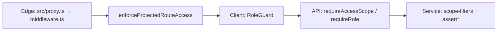
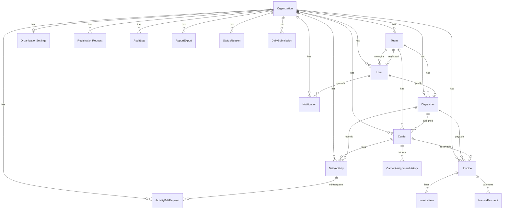
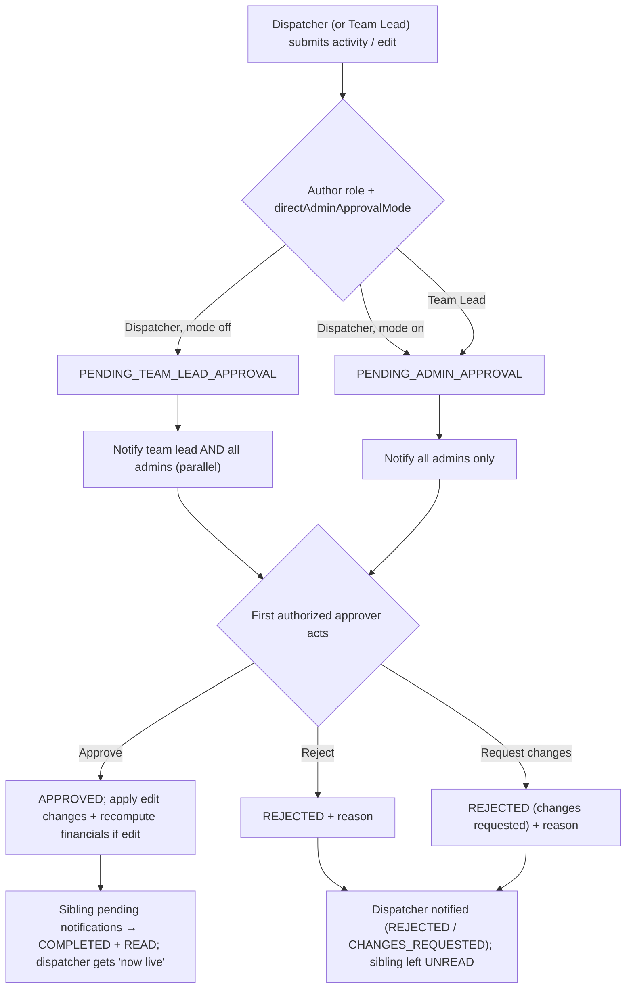
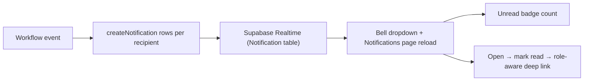
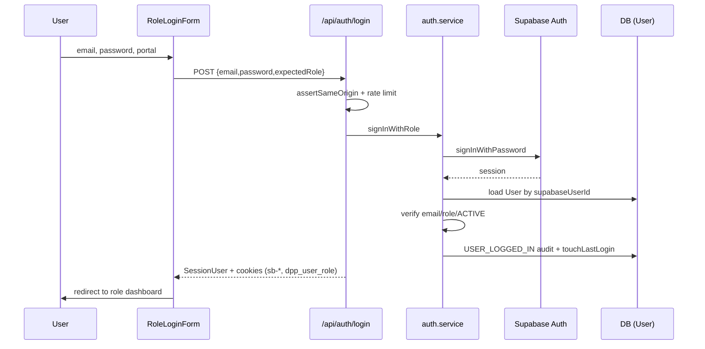
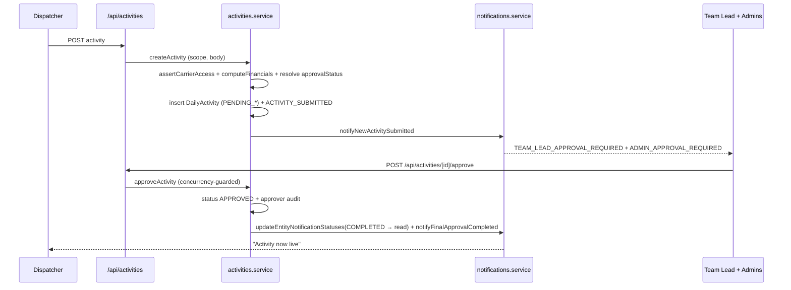
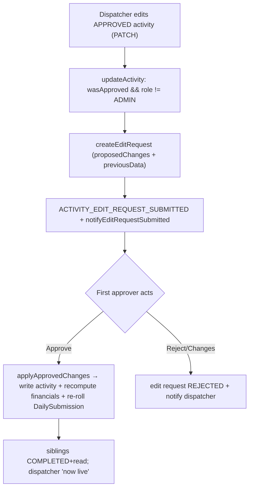
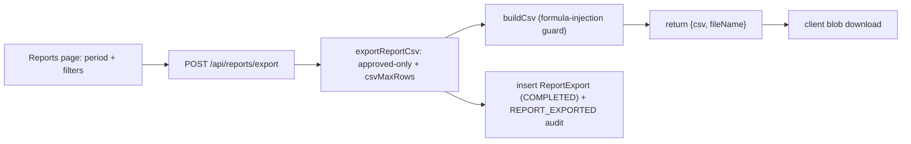
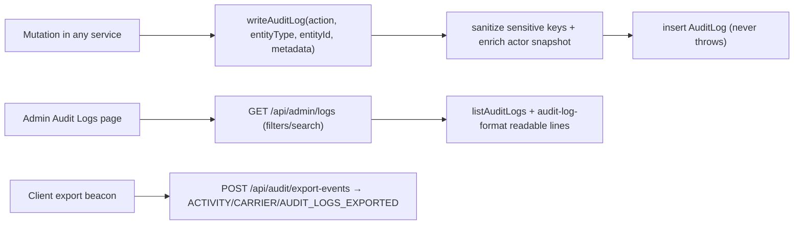
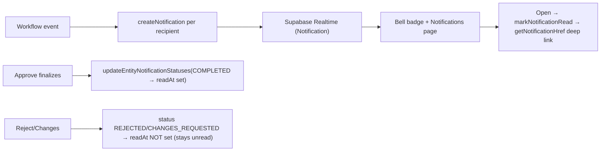

# Dispatcher Performance Platform — System Flow & Technical Documentation

> **Document purpose:** The complete, authoritative technical reference for the Dispatcher Performance Platform (DPP). Any developer should be able to read this and understand the whole system end-to-end.
> **Source of truth:** The codebase at `D:\Projects\dispatcher-performance-platform`, scanned and verified against real code.
> **Rule:** Every statement is derived from implemented code. Where something is not implemented or could not be fully verified, it is explicitly marked `Status: Not implemented yet`, `Status: Partially implemented`, or `Unclear / Needs verification`.

**Related docs:** [`docs/admin.md`](docs/admin.md) · [`docs/lead.md`](docs/lead.md) · [`docs/dispatcher.md`](docs/dispatcher.md) · [`docs/security-hardening.md`](docs/security-hardening.md) · [`docs/performance-audit-admin-login.md`](docs/performance-audit-admin-login.md)

---

## Table of Contents

1. [Project Overview](#1-project-overview)
2. [Complete Folder and File Structure](#2-complete-folder-and-file-structure)
3. [Tech Stack](#3-tech-stack)
4. [Authentication Flow](#4-authentication-flow)
5. [User Roles and Permissions](#5-user-roles-and-permissions)
6. [Database Structure](#6-database-structure)
7. [Complete API Documentation](#7-complete-api-documentation)
8. [Complete System Flow](#8-complete-system-flow)
9. [Activity Approval Flow](#9-activity-approval-flow)
10. [Audit Log Flow](#10-audit-log-flow)
11. [Reports and Export Flow](#11-reports-and-export-flow)
12. [Dashboard Flow](#12-dashboard-flow)
13. [Finance Flow](#13-finance-flow)
14. [Notification Flow](#14-notification-flow)
15. [Frontend Page Flow](#15-frontend-page-flow)
16. [Module-by-Module Explanation](#16-module-by-module-explanation)
17. [Data Flow Diagrams](#17-data-flow-diagrams)
18. [Important Business Rules](#18-important-business-rules)
19. [Known Issues or Missing Items](#19-known-issues-or-missing-items)
20. [Final Developer Notes](#20-final-developer-notes)
21. [Invoice Module Overview](#invoice-module-overview) _(extended module — same document)_

---

## 1. Project Overview

### What the platform does

The **Dispatcher Performance Platform (DPP)** is a multi-tenant web application for freight dispatch organizations. It tracks **daily load activities** per **carrier** (a trucking company / driver record), runs every dispatcher submission and edit through a **parallel approval workflow**, calculates **revenue**, **dispatch fees**, and **rate per mile**, and surfaces performance through **role-based dashboards**, **rankings**, **reports**, and **finance views**. Workflow events are pushed to users via an **in-app notification system** (with Supabase Realtime) and recorded in an **audit log**.

### Problem it solves

Dispatch organizations need one system to:

- Assign carriers to teams and dispatchers.
- Log daily load outcomes (delivered, cancelled, not booked, not working).
- Review and approve dispatcher submissions and edits before they count.
- Measure dispatcher, carrier, and team performance.
- Notify approvers and dispatchers of workflow events in real time.
- Keep an immutable record of who did what (audit logs).
- Export operational and financial reports (CSV + PDF).
- Onboard users with admin approval.

### Users and roles

There are **three login roles** (`UserRole` enum in `prisma/schema.prisma`): `ADMIN`, `TEAM_LEAD`, `DISPATCHER`.

| Persona                    | In code               | How they use the platform                                                                                                                                                                                                               |
| -------------------------- | --------------------- | --------------------------------------------------------------------------------------------------------------------------------------------------------------------------------------------------------------------------------------- |
| **Admin**                  | `UserRole.ADMIN`      | Company-wide access: teams, dispatchers, carriers, activities, pending approvals, audit logs, notifications, rankings, reports, daily report, settings, user registration approvals, managed-user creation, and per-dispatcher finance. |
| **Team Lead**              | `UserRole.TEAM_LEAD`  | Team-scoped access: monitor and manage dispatchers and carriers on their team; review **Pending Approvals** and **Notifications** for their team; view team-scoped rankings and reports; approve team submissions.                      |
| **Dispatcher**             | `UserRole.DISPATCHER` | Personal scope: view assigned carriers (read-only), log daily activities (which enter approval), track their own submissions, receive notifications, view personal performance and finance.                                             |
| **Carrier**                | _Not a login role_    | A **business entity** (trucking company / driver). Carriers never sign in; admins/team leads manage them and they appear in dispatcher activity forms.                                                                                  |
| **Finance / Account user** | _Not a separate role_ | Finance is a **feature area**, not a role. Dispatchers use `/dispatcher/finance`; admins use `/admin/dispatchers/[dispatcherId]/finance`. Every role has an **Account** page.                                                           |

---

## 2. Complete Folder and File Structure

This is the real structure (verified). Generated Prisma client lives in `src/generated/prisma` (gitignored).

```text
dispatcher-performance-platform/
├── prisma/
│   ├── schema.prisma          # Data model — source of truth for tables/enums
│   └── migrations/            # SQL migrations (init, approval workflow, edit
│                              #   requests + notifications, carrier notes,
│                              #   performance indexes, audit user login, etc.)
├── scripts/
│   ├── bootstrap.ts           # Seed org, settings, status reasons
│   ├── build.mjs / next-build.mjs  # Build wrappers (Windows path-casing safe)
│   ├── seed-demo-data.ts
│   ├── sync-auth-user.ts      # Link a Supabase auth user to a DB User row
│   ├── reset-user-password.ts
│   └── create-admin-user.ts
├── docs/                      # Role guides + security/perf notes
├── public/
│   └── pdf_logo.jpeg          # Logo embedded in branded PDF exports
├── src/
│   ├── app/                                  # Next.js App Router (pages + API)
│   │   ├── page.tsx                           # Portal picker (3 sign-in cards)
│   │   ├── global-error.tsx                   # Root error boundary
│   │   ├── session-expired/                   # Expired-session screen
│   │   ├── auth/                              # reset-password, update-password pages + callback route
│   │   ├── admin/                             # Admin portal pages
│   │   ├── team-lead/                         # Team-lead portal pages
│   │   ├── dispatcher/                        # Dispatcher portal pages
│   │   └── api/                               # REST API route handlers (65 route.ts files)
│   ├── components/
│   │   ├── account/           # Account page + dispatcher finance summary
│   │   ├── activities/        # Activities page, excel filters, PDF button, approval badge,
│   │   │                      #   pending-approvals, dispatcher submissions
│   │   ├── admin/             # User requests page, audit logs page
│   │   ├── auth/              # Login form, RoleGuard, SessionProvider, register, update-password
│   │   ├── carriers/          # Carriers page + excel filters
│   │   ├── daily-report/      # Admin daily report
│   │   ├── dashboard/         # Role-specific dashboard widgets
│   │   ├── dashboards/        # Full dashboard page compositions (admin/team-lead/dispatcher/performance)
│   │   ├── details/           # Entity detail views (incl. activity change comparison)
│   │   ├── dispatchers/       # Dispatchers page
│   │   ├── feedback/          # Loading / empty / error / toast / page-content-gate
│   │   ├── filters/           # Shared filter bars and fields
│   │   ├── finance/           # Finance page + tables + export
│   │   ├── forms/             # React Hook Form entity forms
│   │   ├── invoices/          # Invoice list/detail/generation UI (admin/TL/dispatcher)
│   │   ├── layout/            # DashboardShell, sidebar, top nav, global search
│   │   ├── modals/            # Entity CRUD + activity detail modals
│   │   ├── notifications/     # Notifications dropdown + page
│   │   ├── providers/         # SessionProvider + EntityOptionsProvider (lazy)
│   │   ├── rankings/          # Rankings page
│   │   ├── reports/           # Reports page
│   │   ├── settings/          # Settings page + form
│   │   ├── tables/            # Data tables per entity
│   │   └── ui/                # shadcn / Base UI primitives
│   ├── hooks/                 # use-api-data, use-entity-options, use-role-scope,
│   │                          #   use-realtime-refresh, use-daily-report-realtime, use-notification-sound
│   ├── lib/
│   │   ├── api/               # HTTP client (client.ts) + resource functions (resources.ts)
│   │   ├── audit/             # audit-log-format.ts (readable "Label: value" rendering)
│   │   ├── auth/              # roles.ts (nav per role), permissions.ts, session-types, session-role-cookie
│   │   ├── constants/         # Enums, labels, filter options (roles, date-ranges, etc.)
│   │   ├── dashboard/         # Dashboard filter param builders
│   │   ├── db/                # Supabase DB client (client.ts), table names (T), types, embeds, utils
│   │   ├── errors/            # Typed error classes
│   │   ├── filters/           # URL/state filter parsing helpers
│   │   ├── notifications/     # Notification deep-link helpers (+ tests)
│   │   ├── reports/           # PDF exports + pdf-theme + metrics + filter labels
│   │   ├── invoices/          # Invoice PDF/CSV export helpers (uses pdf-theme)
│   │   ├── supabase/          # Browser/server auth clients + edge middleware helpers
│   │   ├── utils/             # Calculations, formatting, date ranges, csv.ts
│   │   └── validation/        # Zod schemas (common.ts has idSchema, etc.)
│   ├── server/
│   │   ├── api/               # request.ts (parse body/query), response.ts (handleApi envelope)
│   │   ├── auth/              # session.ts (getCurrentUser), jwks-cache.ts, require-auth.ts, auth.service.ts, types.ts
│   │   ├── mappers/           # DB row → DTO mappers (index.ts)
│   │   ├── services/          # Business logic per domain (incl. invoices.service.ts)
│   │   └── utils/             # scope-filters, approval-workflow, activity-filters,
│   │                          #   request-security, rate-limit, text-search
│   ├── generated/prisma/      # Generated Prisma client (gitignored)
│   └── proxy.ts               # Edge middleware entry (session refresh + route guard)
├── .env.example
├── next.config.ts             # Legacy redirects, Windows path normalization, Prisma tracing
├── package.json
└── tsconfig.json
```

### Important files at a glance

| File                                                   | Role                                                                                                                                |
| ------------------------------------------------------ | ----------------------------------------------------------------------------------------------------------------------------------- |
| `src/proxy.ts` → `src/lib/supabase/middleware.ts`      | Edge middleware: session refresh + protected-route enforcement.                                                                     |
| `src/server/auth/session.ts`                           | `getCurrentUser()` — request-cached current user via `getClaims()`.                                                                 |
| `src/server/auth/require-auth.ts`                      | Route guards: `requireAccessScope`, `requireActiveUser`, `requireRole`, `requireAdminOrTeamLeadScope`.                              |
| `src/server/api/response.ts`                           | `handleApi()` envelope + error→status mapping + same-origin check.                                                                  |
| `src/lib/db/client.ts`                                 | Supabase service-role client (`db()`) + table name map (`T`).                                                                       |
| `src/lib/api/resources.ts`                             | Frontend → API call map (the "where used in frontend" source).                                                                      |
| `src/lib/reports/pdf-theme.ts`                         | Shared PDF theme (palette, badges, header/footer, logo) — used by activity, carrier, audit-adjacent, performance, and invoice PDFs. |
| `src/lib/invoices/export-invoice-pdf.ts`               | Single-invoice branded PDF (shared `pdf-theme`).                                                                                    |
| `src/lib/invoices/export-invoice-list-pdf.ts`          | Invoice list PDF export.                                                                                                            |
| `src/components/providers/entity-options-provider.tsx` | Lazy entity lists (`teams`/`dispatchers`/`carriers`) — fetch-on-first-consume via `ensureLoaded()`.                                 |
| `src/lib/audit/audit-log-format.ts`                    | Readable audit data formatting (table/CSV/PDF).                                                                                     |
| `src/lib/utils/csv.ts`                                 | CSV builder + formula-injection guard.                                                                                              |

---

## 3. Tech Stack

From `package.json` (verified):

| Layer                         | Technology                                                                                                                                                     |
| ----------------------------- | -------------------------------------------------------------------------------------------------------------------------------------------------------------- |
| Framework                     | **Next.js 16** (App Router), **React 19**, **TypeScript 5**                                                                                                    |
| API structure                 | Next.js route handlers under `src/app/api/**/route.ts`; uniform JSON envelope `{ ok, data }` / `{ ok, error }`                                                 |
| Database                      | **PostgreSQL** (hosted via Supabase)                                                                                                                           |
| ORM / schema                  | **Prisma 7** (`@prisma/client`, `prisma`, `@prisma/adapter-pg`) — used for schema, migrations, generate, and scripts only                                      |
| Runtime DB access             | **Supabase JS service-role client** (`@supabase/supabase-js`) via `db()` — _not_ Prisma at runtime                                                             |
| Auth                          | **Supabase Auth** (`@supabase/ssr` + `@supabase/supabase-js`); local JWT verification via `getClaims()` + cached JWKS                                          |
| Realtime                      | **Supabase Realtime** (`postgres_changes`)                                                                                                                     |
| Styling / UI                  | **Tailwind CSS 4**, **@base-ui/react** (shadcn-style primitives), `class-variance-authority`, `clsx`, `tailwind-merge`, `tw-animate-css`, `lucide-react` icons |
| Forms / validation            | **react-hook-form** + `@hookform/resolvers`, **zod 4**                                                                                                         |
| Charts                        | **recharts 3**                                                                                                                                                 |
| PDF export                    | **jspdf 4** + **jspdf-autotable 5** (client-side)                                                                                                              |
| CSV export                    | Shared hardened builder (`src/lib/utils/csv.ts`) with formula-injection protection                                                                             |
| Money precision               | **decimal.js** (schema uses Postgres `Decimal`)                                                                                                                |
| Dates                         | **date-fns 4**                                                                                                                                                 |
| DB driver (scripts/readiness) | **pg 8**                                                                                                                                                       |
| Tooling                       | ESLint 9, Prettier 3, tsx, `shadcn` CLI                                                                                                                        |

> `@tanstack/react-table` is a dependency but is **not imported** anywhere in `src/` — tables are not interactively sortable. `Status: Unused dependency`.

---

## 4. Authentication Flow

### Provider and linkage

- **Provider:** Supabase Auth (email/password).
- **App-user linkage:** `User.supabaseUserId` must match the Supabase user after sign-in.
- **Role enforcement at login:** the `expectedRole` in the login body must match `User.role`.
- **Status gate:** only `status === ACTIVE` users may sign in; `PENDING_APPROVAL`/`INACTIVE`/`INVITED` are blocked with role-specific screens.

### Login

1. User lands on `/` and picks the Admin, Team Lead, or Dispatcher portal.
2. `RoleLoginForm` posts to `POST /api/auth/login` with `{ email, password, expectedRole }`.
3. Server (`src/server/auth/auth.service.ts`, `signInWithRole`): Supabase password sign-in → load `User` by `supabaseUserId` → verify email/role/ACTIVE status → write `USER_LOGGED_IN` audit + `touchLastLogin`.
4. On success: Supabase session cookies + an httpOnly `dpp_user_role` cookie are set; response returns the `SessionUser`.
5. The login route is rate-limited (`assertRateLimit`) and same-origin-checked (`assertSameOrigin`).
6. Client `SessionProvider` calls `GET /api/auth/me` once on mount and stores the `SessionUser`.
7. `RoleGuard` (in each role layout) validates the session before rendering `DashboardShell`.

On failure the server records `USER_LOGIN_FAILED` (with `actorUserId: null` and a reason such as `INVALID_CREDENTIALS`, `AUTH_USER_NOT_LINKED`, `WRONG_PORTAL`, or `ACCOUNT_<status>`).

### Registration

- **Dispatcher self-registration only:** `/dispatcher/register` → `POST /api/auth/register` creates a `RegistrationRequest` (`requestedRole: DISPATCHER`, `status: PENDING`). No auth user is created yet.
- On the next login attempt the pending user sees a `PendingApprovalScreen`.
- An admin approves at `/admin/users/requests` (`POST /api/users/requests/[id]/approve`), which provisions the Supabase auth user + `User` row (and a `Dispatcher` row when the assigned role is dispatcher) and assigns role/team + a temporary password.
- Admins can also create users directly via `POST /api/users` (managed-user creation, role `DISPATCHER` or `TEAM_LEAD`).

### Session / current-user check

| Layer            | Mechanism                                                                                                                                                                                                                                                                                                                                             |
| ---------------- | ----------------------------------------------------------------------------------------------------------------------------------------------------------------------------------------------------------------------------------------------------------------------------------------------------------------------------------------------------- |
| Supabase cookies | `sb-*-auth-token` — refreshed in the edge proxy (skipped for `/api/*` and public paths).                                                                                                                                                                                                                                                              |
| Role hint cookie | `dpp_user_role` (httpOnly) — fast route-role checks in middleware.                                                                                                                                                                                                                                                                                    |
| Client state     | `SessionProvider` + `useSession()` (fetches `/api/auth/me` once on mount).                                                                                                                                                                                                                                                                            |
| Server           | `getCurrentUser()` (`src/server/auth/session.ts`) — wrapped in React `cache()` (deduped per request), resolves the Supabase user id via `getClaims()` (local JWT verify against a **module-cached JWKS**, `src/server/auth/jwks-cache.ts`), then loads the DB user. Legacy symmetric (HS256) projects transparently fall back to network `getUser()`. |

### Password reset / logout

- **Reset:** `/auth/reset-password` → `POST /api/auth/forgot-password` → Supabase email → `/auth/callback` (code exchange) → `/auth/update-password` → `POST /api/auth/update-password` (requires an authenticated session; writes `USER_PASSWORD_CHANGED`).
- **Logout:** `POST /api/auth/logout` clears the session (writes `USER_LOGGED_OUT` if a user is resolved) → redirect to role login with `?loggedOut=1`.

### Protected routes & role-based redirects

Enforced in **four layers**:



| Layer                        | Behavior                                                                                                                                                                                                                                                              |
| ---------------------------- | --------------------------------------------------------------------------------------------------------------------------------------------------------------------------------------------------------------------------------------------------------------------- |
| Edge (`middleware.ts`)       | Refreshes Supabase session (3s timeout race; skipped for `/`, public auth paths, `/api/public/*`, `/api/health`, and all `/api/*`). Then `enforceProtectedRouteAccess` redirects unauthenticated users to the role login and wrong-role users to their own dashboard. |
| Client (`RoleGuard`)         | Shows session/status screens; redirects wrong-role to own dashboard.                                                                                                                                                                                                  |
| API (`require-auth.ts`)      | `requireAccessScope([role])` → 401 (`UnauthorizedError`) or 403 (`ForbiddenError`) JSON.                                                                                                                                                                              |
| Service (`scope-filters.ts`) | Supabase queries filtered by org + team/dispatcher; cross-scope access throws `ForbiddenError`.                                                                                                                                                                       |

| Condition                            | Redirect                                      |
| ------------------------------------ | --------------------------------------------- |
| Protected role path, no auth cookies | Role login (`ROLE_LOGIN_PATH`)                |
| Wrong role cookie vs path            | User's dashboard (`ROLE_DASHBOARD_PATH`)      |
| Client: no session                   | `router.replace(loginPath)`                   |
| API 401 from client                  | Login with `?expired=1` or `/session-expired` |

---

## 5. User Roles and Permissions

### Statuses & scope

| `UserStatus`       | Meaning                    | UI behavior             |
| ------------------ | -------------------------- | ----------------------- |
| `ACTIVE`           | Approved, can use the app  | Full access per role    |
| `PENDING_APPROVAL` | Registered, awaiting admin | `PendingApprovalScreen` |
| `INACTIVE`         | Deactivated                | `AccessDenied` screen   |
| `INVITED`          | Invitation not accepted    | `AccessDenied` screen   |

Scope (`AccessScope`) is `{ organizationId, role, userId, teamId, dispatcherId, isCompanyWide }`. `isCompanyWide = role === ADMIN`. Built in `src/server/auth/types.ts`; client mirror in `src/lib/role-scope.ts`. `scope-filters.ts`: admin → no constraint; team lead → own `teamId`; dispatcher → own `dispatcherId`; otherwise a sentinel that matches nothing.

### Permission matrix (verified against route guards + services)

| Capability                                     |        Admin         |         Team Lead         |         Dispatcher          |
| ---------------------------------------------- | :------------------: | :-----------------------: | :-------------------------: |
| Create teams                                   |          ✓           |             —             |              —              |
| Edit / activate / deactivate teams             |          ✓           |             —             |              —              |
| List teams                                     |          ✓           |        ✓ (scoped)         |              —              |
| Create dispatcher (DISPATCHER role)            |          ✓           |       ✓ (own team)        |              —              |
| Create team lead (TEAM_LEAD role)              |          ✓           |             —             |              —              |
| Edit / activate / deactivate dispatchers       |          ✓           |         ✓ (team)          |              —              |
| Create / edit / reassign / deactivate carriers |          ✓           |         ✓ (team)          |              —              |
| List carriers                                  |          ✓           |         ✓ (team)          |   ✓ (assigned, read-only)   |
| Add activity (auto-approved)                   |          ✓           |   ✓ (→ admin approval)    |              —              |
| Add activity (enters approval)                 |          —           |             —             |      ✓ (own carriers)       |
| Edit activity directly                         |          ✓           | via edit request → admin  |              —              |
| Edit activity via edit-request                 |          —           |             ✓             |              ✓              |
| Approve / reject / request changes             |          ✓           | ✓ (team, TL-pending only) |              —              |
| Pending Approvals page                         |          ✓           |         ✓ (team)          |              —              |
| My Submissions page                            |          —           |             —             |              ✓              |
| View dashboards                                |     ✓ (company)      |         ✓ (team)          |          ✓ (self)           |
| View / export reports (CSV)                    |          ✓           |         ✓ (team)          |              —              |
| Daily Report (live snapshot)                   |          ✓           |             —             |              —              |
| View finance                                   |  ✓ (any dispatcher)  |             —             |          ✓ (self)           |
| Export finance (CSV)                           |  ✓ (per dispatcher)  |             —             |          ✓ (self)           |
| Finance PDF                                    | ✓ (`window.print()`) |             —             |    ✓ (`window.print()`)     |
| View audit logs + export                       |          ✓           |             —             |              —              |
| View notifications / mark read                 |          ✓           |             ✓             |              ✓              |
| Manage settings                                |          ✓           |             —             |              —              |
| Approve/reject user registration requests      |          ✓           |             —             |              —              |
| Create managed users / reset their password    |          ✓           |             —             |              —              |
| Activities PDF export                          |          ✓           |             ✓             |  ✓ (incl. approval column)  |
| Carrier PDF export (admin carriers menu)       |          ✓           |             —             |              —              |
| View invoices / export invoice PDF             |    ✓ (manage all)    |      ✓ (team-scoped)      | ✓ (own payable, view + PDF) |
| Global search                                  |          ✓           |             ✓             |         ✓ (scoped)          |
| Rankings — dispatcher                          |          ✓           |         ✓ (team)          |        ✓ (self only)        |
| Rankings — carrier / team                      |          ✓           |         ✓ (team)          |              —              |

> **Team Lead creation note:** the "Create Dispatcher" form only offers the `DISPATCHER` role. New **Team Leads** are created via the **User Requests** approval flow, the **managed-user** create endpoint (`POST /api/users`), or scripts — never as a `Dispatcher` row.

**Delete behavior:** no hard-delete UI for core entities. Teams/dispatchers/carriers use **soft delete** (`deletedAt`) and **deactivate** (`status → INACTIVE`). Activities are created/updated/approved/rejected; **no activity delete endpoint exists**. Edit requests and notifications are created/resolved, not deleted.

---

## 6. Database Structure

- **Engine:** PostgreSQL (Supabase-hosted). Connection via `DATABASE_URL` (pooler) and `DIRECT_URL` (migrations).
- **Schema management:** Prisma (`prisma/schema.prisma` + migrations).
- **Runtime access:** Supabase service-role client (`db()`), table names via `T`.
- **Row Level Security:** **Not defined in this repo** — authorization is application-layer (service-role bypasses RLS). See `docs/security-hardening.md`. `Status: Not implemented yet (RLS)`.

**18 models** are defined. ER overview:



### Model reference

| Model                        | Purpose                                                   | Important fields                                                                                                                                                                                                                                                                                                                                                                                                                                                     | Key relations                                                                       | Used by                                             |
| ---------------------------- | --------------------------------------------------------- | -------------------------------------------------------------------------------------------------------------------------------------------------------------------------------------------------------------------------------------------------------------------------------------------------------------------------------------------------------------------------------------------------------------------------------------------------------------------- | ----------------------------------------------------------------------------------- | --------------------------------------------------- |
| **Organization**             | Tenant root                                               | `name`, `slug` (unique), `timezone`, `currency`, `deletedAt`                                                                                                                                                                                                                                                                                                                                                                                                         | parent of all entities                                                              | All modules                                         |
| **User**                     | Login identity                                            | `email`, `fullName`, `role`, `status`, `teamId`, `supabaseUserId` (unique), `lastLoginAt`, `deletedAt`                                                                                                                                                                                                                                                                                                                                                               | `team`, `ledTeams`, `dispatcher`, notifications, audit actor, edit-request approver | Auth, users, dispatchers, teams, notifications      |
| **Team**                     | Dispatch team                                             | `name`, `teamLeadUserId`, `status`                                                                                                                                                                                                                                                                                                                                                                                                                                   | `teamLead`, `members`, `dispatchers`, `carriers`                                    | Teams, scoping                                      |
| **Dispatcher**               | Dispatcher profile                                        | `userId` (unique), `teamId`, `status`                                                                                                                                                                                                                                                                                                                                                                                                                                | `user`, `team`, `carriers`, `dailyActivities`                                       | Dispatchers, activities, finance                    |
| **Carrier**                  | Trucking company / driver                                 | `carrierName`, `driverName`, `mcNumber`, `truckType`, `teamId`, `dispatcherId`, `dispatchFeePercentage`, `status`, **`notes`**                                                                                                                                                                                                                                                                                                                                       | `team`, `dispatcher`, `dailyActivities`, `assignmentHistory`                        | Carriers, activities, finance                       |
| **CarrierAssignmentHistory** | Reassignment trail                                        | `carrierId`, `teamId`, `dispatcherId`, name snapshots, `assignedAt`, `unassignedAt`, `assignedByUserId`                                                                                                                                                                                                                                                                                                                                                              | `carrier`, `team`, `dispatcher`, `assignedBy`                                       | Carrier reassign                                    |
| **DailyActivity**            | Daily load record                                         | `activityDate`, `carrierId`, `dispatcherId`, `teamId`, `status`, snapshots (carrier/driver/dispatcher/team/truckType/fee%), `origin`, `destination`, `totalMiles`, `loadAmount`, `ratePerMile`, `dispatchFee`, `reason`, `notes`, **`approvalStatus`**, **`approvalType`**, `submittedById`, `teamLeadApprovedById`, `adminApprovedById`, `rejectedById`, `rejectionReason`, `approvalNotes`, plus `submittedAt`/`teamLeadApprovedAt`/`adminApprovedAt`/`rejectedAt` | `carrier`, `dispatcher`, `team`, `editRequests`                                     | Activities, approvals, dashboards, reports, finance |
| **DailySubmission**          | Per-dispatcher per-day completion roll-up                 | `dispatcherId`, `submissionDate`, `carrierCount`, `activityCount`                                                                                                                                                                                                                                                                                                                                                                                                    | `dispatcher`, `team`                                                                | Daily submissions, dispatcher dashboard             |
| **StatusReason**             | Org-specific cancel/not-booked reasons                    | `label`, `isActive`, `sortOrder`                                                                                                                                                                                                                                                                                                                                                                                                                                     | org                                                                                 | Activities, settings                                |
| **OrganizationSettings**     | Fee rules + CSV + approval mode                           | `dispatchFeeMethod` (`percentage`), `defaultDispatchFeePercent`, `minimumDispatchFee`, `roundToNearestDollar`, `allowedTruckTypes`, `timezone`, `csvIncludeHeaders`, `csvDateFormat`, `csvMaxRows` (default 10000), `csvFileNamePrefix`, **`directAdminApprovalMode`**                                                                                                                                                                                               | org                                                                                 | Settings, activities, finance, reports              |
| **RegistrationRequest**      | Self-registration queue                                   | `email`, `requestedRole`, `preferredTeamId`/`Name`, `assignedRole`, `assignedTeamId`, `status`, `rejectionReason`                                                                                                                                                                                                                                                                                                                                                    | org, `reviewedBy`                                                                   | Auth, user requests                                 |
| **ActivityEditRequest**      | Pending edit to an APPROVED activity                      | `originalActivityId`, `teamId`, `dispatcherId`, `approvalStatus`, `proposedChanges` (JSON), `previousData` (JSON), approver/submitter ids + timestamps, `rejectionReason`, `approvalNotes`                                                                                                                                                                                                                                                                           | `originalActivity`, `team`, `dispatcher`, submitter/editor/approvers                | Edit requests, approvals                            |
| **Notification**             | In-app notification                                       | `recipientUserId`, `title`, `message`, `notificationStatus`, `activityId?`, `editRequestId?`, `metadata` (JSON), `readAt`                                                                                                                                                                                                                                                                                                                                            | org, `recipient`                                                                    | Notifications                                       |
| **AuditLog**                 | Immutable action log                                      | `actorUserId?`, `action` (`AuditAction`), `entityType`, `entityId?`, `metadata`                                                                                                                                                                                                                                                                                                                                                                                      | org, `actor`                                                                        | Audit logs                                          |
| **ReportExport**             | Report export job record                                  | `requestedById`, `reportType`, `period`, `filters` (JSON), `status`, `fileName`, `rowCount`, `errorMessage`, `completedAt`                                                                                                                                                                                                                                                                                                                                           | org, `requestedBy`                                                                  | Reports                                             |
| **Invoice**                  | Invoice header (dispatcher payable or carrier receivable) | `invoiceNumber`, `invoiceType`, `invoiceStatus`, `paymentStatus`, `dispatcherId?`, `carrierId?`, `teamId`, period dates, `totalAmount`, `paidAmount`, `pendingAmount`, `issueDate`, `dueDate`, soft delete                                                                                                                                                                                                                                                           | org, dispatcher, carrier, team, items, payments                                     | Invoices                                            |
| **InvoiceItem**              | Activity line on an invoice                               | `dailyActivityId`, route/miles/load/fee snapshots, `amount`, `description`                                                                                                                                                                                                                                                                                                                                                                                           | invoice, activity                                                                   | Invoices                                            |
| **InvoicePayment**           | Payment against an invoice                                | `amount`, `paymentDate`, `paymentMethod`, `reference`, `notes`, `recordedById`                                                                                                                                                                                                                                                                                                                                                                                       | invoice                                                                             | Invoices                                            |

### Enums

| Enum                                  | Values                                                                                                                  |
| ------------------------------------- | ----------------------------------------------------------------------------------------------------------------------- |
| `UserRole`                            | ADMIN, TEAM_LEAD, DISPATCHER                                                                                            |
| `UserStatus`                          | ACTIVE, PENDING_APPROVAL, INACTIVE, INVITED                                                                             |
| `TeamStatus` (also dispatcher status) | ACTIVE, INACTIVE                                                                                                        |
| `CarrierStatus`                       | ACTIVE, INACTIVE                                                                                                        |
| `LoadActivityStatus`                  | DELIVERED, CANCELLED, NOT_BOOKED, NOT_WORKING                                                                           |
| `TruckType`                           | DRY_VAN, REEFER, FLATBED, BOX_TRUCK, HOTSHOT, POWER_ONLY, CARGO_VAN                                                     |
| `RegistrationRequestStatus`           | PENDING, APPROVED, REJECTED                                                                                             |
| `ReportExportStatus`                  | PENDING, COMPLETED, FAILED                                                                                              |
| `ActivityApprovalStatus`              | APPROVED, PENDING_TEAM_LEAD_APPROVAL, PENDING_ADMIN_APPROVAL, REJECTED                                                  |
| `ActivityApprovalType`                | NEW_ACTIVITY, EDIT_ACTIVITY                                                                                             |
| `NotificationStatus`                  | PENDING, APPROVED, REJECTED, CHANGES_REQUESTED, ADMIN_APPROVAL_REQUIRED, TEAM_LEAD_APPROVAL_REQUIRED, COMPLETED         |
| `AuditAction`                         | 50+ values (see [§10](#10-audit-log-flow); invoice actions listed in [Invoice Audit Log Flow](#invoice-audit-log-flow)) |
| `InvoiceType`                         | DISPATCHER_PAYABLE, CARRIER_RECEIVABLE                                                                                  |
| `InvoiceStatus`                       | DRAFT, ISSUED, PARTIALLY_PAID, PAID, OVERDUE, CANCELLED                                                                 |
| `PaymentStatus`                       | UNPAID, PARTIALLY_PAID, PAID                                                                                            |
| `InvoicePaymentMethod`                | CASH, BANK_TRANSFER, CARD, CHECK, OTHER                                                                                 |

### Key constraints & indexes

- `User`: unique `(organizationId, email)`, unique `supabaseUserId`; index `(organizationId, role, status)`.
- `Team`: unique `(organizationId, name)`.
- `Carrier`: unique `(organizationId, mcNumber)`.
- `DailyActivity`: non-unique `(carrierId, activityDate)` lookup index; indexes on `(organizationId, approvalStatus)`, `(teamId, approvalStatus)`, plus date/status indexes. Multiple activities for the same carrier/date are allowed and stored as separate rows.
- `ActivityEditRequest`: indexes on `(organizationId|originalActivityId|teamId|dispatcherId, approvalStatus)`.
- `Notification`: indexes on `(recipientUserId, readAt, createdAt)`, `(organizationId, createdAt)`.
- `DailySubmission`: unique `(dispatcherId, submissionDate)`.
- Soft delete (`deletedAt`) on Organization, User, Team, Dispatcher, Carrier.

> **Finance/payment tables:** invoice/payment tracking now lives in the Invoice module (`Invoice`, `InvoiceItem`, `InvoicePayment`). The legacy dispatcher finance page still computes period earnings from `DailyActivity` and does not replace invoice/payment status. `Status: Invoice payment tracking implemented; finance page integration remains period-summary only`.

---

## 7. Complete API Documentation

**Base URL:** `/api` · **Auth:** Supabase session cookies on protected routes · **Envelope:** `{ ok: true, data }` or `{ ok: false, error }` (`src/server/api/response.ts`). **Total: ~76 HTTP handlers across 65 `route.ts` files** (core platform APIs below + [Invoice APIs](#invoice-api-documentation)).

**Conventions:**

- `handleApi(fn, request?)` wraps responses. Mutating handlers (POST/PATCH) pass `request`, enforcing `assertSameOrigin`; most GET handlers omit it (no origin check on reads).
- Guards (`require-auth.ts`): `requireUser` (authenticated), `requireActiveUser` (active), `requireRole(role)`, `requireAccessScope([role])` (returns `{ user, scope }`), `requireAdminOrTeamLeadScope`. Admin-only routes use `requireAccessScope("ADMIN")`. Several routes do inline `ForbiddenError` role checks.
- Errors: `ValidationError`→400, `UnauthorizedError`→401, `ForbiddenError`→403, `NotFoundError`→404, infra/DB→503, else 500.
- IDs validated by `idSchema` (accepts UUID + CUID).

### 7.1 Auth

| Method · Path                    | Purpose                        | Role                               | Body                                                                             | Audit / Notification                   |
| -------------------------------- | ------------------------------ | ---------------------------------- | -------------------------------------------------------------------------------- | -------------------------------------- |
| POST `/api/auth/login`           | Sign in to a portal            | Public (rate-limited, same-origin) | `{ email, password, expectedRole }`                                              | `USER_LOGGED_IN` / `USER_LOGIN_FAILED` |
| POST `/api/auth/logout`          | Sign out                       | Public (same-origin)               | —                                                                                | `USER_LOGGED_OUT`                      |
| GET `/api/auth/me`               | Current session user (or null) | Public                             | —                                                                                | —                                      |
| POST `/api/auth/register`        | Dispatcher self-registration   | Public (rate-limited)              | `{ fullName, email, phoneNumber, preferredTeamId?, preferredTeamName?, notes? }` | —                                      |
| POST `/api/auth/forgot-password` | Send reset email               | Public (rate-limited)              | `{ email }`                                                                      | —                                      |
| POST `/api/auth/update-password` | Set own password               | Authenticated (`requireUser`)      | `{ password (min 8) }`                                                           | `USER_PASSWORD_CHANGED`                |

### 7.2 Users & registration requests

| Method · Path                           | Purpose                                            | Role  | Body                                                                                                                        | Audit                                           |
| --------------------------------------- | -------------------------------------------------- | ----- | --------------------------------------------------------------------------------------------------------------------------- | ----------------------------------------------- |
| GET `/api/users`                        | List managed dispatcher/team-lead users            | Admin | —                                                                                                                           | —                                               |
| POST `/api/users`                       | Create dispatcher/team-lead (Supabase user + rows) | Admin | `{ fullName, email, phoneNumber?, role(DISPATCHER\|TEAM_LEAD), teamId, password(min8), confirmPassword, status?="ACTIVE" }` | `USER_MANUALLY_CREATED` (+ `TEAM_LEAD_CREATED`) |
| POST `/api/users/[id]/password`         | Admin resets a managed user's password             | Admin | `{ password(min8), confirmPassword }`                                                                                       | `USER_PASSWORD_RESET`                           |
| GET `/api/users/requests`               | List registration requests                         | Admin | —                                                                                                                           | —                                               |
| POST `/api/users/requests/[id]/approve` | Approve → provision user                           | Admin | `{ role, teamId, temporaryPassword(min8) }`                                                                                 | `USER_APPROVED`                                 |
| POST `/api/users/requests/[id]/reject`  | Reject with reason                                 | Admin | `{ reason }`                                                                                                                | `USER_REJECTED`                                 |

Responses for create/reset return `{ user: ManagedUser, credentials: { fullName, email, password, role, loginPath } }` (one-time credentials dialog).

### 7.3 Health & public

| Method · Path           | Purpose                       | Role   | Notes                                          |
| ----------------------- | ----------------------------- | ------ | ---------------------------------------------- |
| GET `/api/health`       | Liveness                      | Public | Raw `{ status:"ok", service }` (not enveloped) |
| GET `/api/health/ready` | Readiness (env + `SELECT 1`)  | Public | 200 ready / 503 not_ready                      |
| GET `/api/public/teams` | Active teams for registration | Public | `[{ id, name }]`                               |

### 7.4 Teams

| Method · Path           | Purpose       | Role       | Body                                  | Audit                                                                    |
| ----------------------- | ------------- | ---------- | ------------------------------------- | ------------------------------------------------------------------------ |
| GET `/api/teams`        | List (scoped) | Any active | —                                     | —                                                                        |
| POST `/api/teams`       | Create team   | Admin      | `{ name, teamLeadUserId?, status }`   | `TEAM_CREATED` (+ `TEAM_LEAD_ASSIGNED`)                                  |
| PATCH `/api/teams/[id]` | Update team   | Admin      | `{ name?, teamLeadUserId?, status? }` | `TEAM_UPDATED`/`TEAM_ACTIVATED`/`TEAM_DEACTIVATED`, `TEAM_LEAD_ASSIGNED` |

### 7.5 Dispatchers

| Method · Path                 | Purpose                       | Role                                  | Body / Query                                              | Audit                                                                                   |
| ----------------------------- | ----------------------------- | ------------------------------------- | --------------------------------------------------------- | --------------------------------------------------------------------------------------- |
| GET `/api/dispatchers`        | List (scoped)                 | Any active (service scopes)           | `?q, teamId, dispatcherId`                                | —                                                                                       |
| POST `/api/dispatchers`       | Create dispatcher / team lead | Admin or Team Lead (service enforces) | `{ fullName, email, phoneNumber?, teamId, role, status }` | `DISPATCHER_CREATED` / `TEAM_LEAD_CREATED`                                              |
| PATCH `/api/dispatchers/[id]` | Update                        | Admin/Team Lead (scoped)              | partial dispatcher                                        | `DISPATCHER_UPDATED` (+ `USER_ROLE_ASSIGNED`/`USER_TEAM_ASSIGNED`)                      |
| POST `/api/dispatchers/[id]`  | Activate/deactivate           | Admin/Team Lead                       | `{ action: "activate"\|"deactivate" }`                    | `DISPATCHER_REACTIVATED`+`USER_ACTIVATED` / `DISPATCHER_DEACTIVATED`+`USER_DEACTIVATED` |

### 7.6 Carriers

| Method · Path                      | Purpose                      | Role                | Body / Query                                                                                                              | Audit                                             |
| ---------------------------------- | ---------------------------- | ------------------- | ------------------------------------------------------------------------------------------------------------------------- | ------------------------------------------------- |
| GET `/api/carriers`                | List (rich filters)          | Any active (scoped) | `?q, teamId(s), dispatcherId(s), carrierId, truckType(s), status(es)`                                                     | —                                                 |
| POST `/api/carriers`               | Create carrier (incl. notes) | Admin/Team Lead     | `{ carrierName, driverName, mcNumber, dispatchFeePercentage?, truckType, teamId, dispatcherId, status="ACTIVE", notes? }` | `CARRIER_CREATED`                                 |
| PATCH `/api/carriers/[id]`         | Update                       | Admin/Team Lead     | partial carrier                                                                                                           | `CARRIER_UPDATED` (+ `_ACTIVATED`/`_DEACTIVATED`) |
| POST `/api/carriers/[id]/reassign` | Reassign team/dispatcher     | Admin/Team Lead     | `{ teamId, dispatcherId, notes? }`                                                                                        | `CARRIER_REASSIGNED`                              |

### 7.7 Activities & approval

| Method · Path                       | Purpose                                                   | Role                     | Body                                                                                                    | Audit / Notification                                                                                              |
| ----------------------------------- | --------------------------------------------------------- | ------------------------ | ------------------------------------------------------------------------------------------------------- | ----------------------------------------------------------------------------------------------------------------- |
| GET `/api/activities`               | List with activity + approval filters                     | Any active (scoped)      | —                                                                                                       | —                                                                                                                 |
| POST `/api/activities`              | Create activity (dispatcher → pending; admin → live)      | Any active               | `{ activityDate, carrierId, status, notes?, origin?, destination?, totalMiles?, loadAmount?, reason? }` | `ACTIVITY_CREATED` / `ACTIVITY_SUBMITTED`; `notifyNewActivitySubmitted`                                           |
| PATCH `/api/activities/[id]`        | Update; non-admin edit of APPROVED → creates edit request | Any active               | partial activity                                                                                        | `ACTIVITY_UPDATED` / `ACTIVITY_PENDING_UPDATED` / `ACTIVITY_EDIT_REQUEST_SUBMITTED`; `notifyEditRequestSubmitted` |
| POST `/api/activities/[id]/approve` | Approve a pending activity                                | Admin/Team Lead (inline) | `{ approvalNotes? }`                                                                                    | `ACTIVITY_APPROVED_BY_TEAM_LEAD`/`_ADMIN`; sibling notifications → COMPLETED+read, `notifyFinalApprovalCompleted` |
| POST `/api/activities/[id]/reject`  | Reject / request changes                                  | Admin/Team Lead (inline) | `{ reason, requestChanges?, approvalNotes? }`                                                           | `ACTIVITY_REJECTED` / `ACTIVITY_CHANGES_REQUESTED`; `notifyDispatcherOutcome`                                     |
| GET `/api/activities/pending`       | Pending approvals (activities + edit requests)            | Admin/Team Lead (inline) | —                                                                                                       | —                                                                                                                 |
| GET `/api/activities/submissions`   | Dispatcher's own submissions                              | Dispatcher (inline)      | —                                                                                                       | —                                                                                                                 |

### 7.8 Edit requests

| Method · Path                                   | Purpose                                                        | Role                     | Body                                          | Audit / Notification                                                                                |
| ----------------------------------------------- | -------------------------------------------------------------- | ------------------------ | --------------------------------------------- | --------------------------------------------------------------------------------------------------- |
| POST `/api/activity-edit-requests/[id]/approve` | Approve edit (applies proposed changes; recomputes financials) | Admin/Team Lead (inline) | `{ approvalNotes? }`                          | `ACTIVITY_APPROVED_BY_TEAM_LEAD`/`_ADMIN` (entity `ActivityEditRequest`); siblings → COMPLETED+read |
| POST `/api/activity-edit-requests/[id]/reject`  | Reject / request changes                                       | Admin/Team Lead (inline) | `{ reason, requestChanges?, approvalNotes? }` | `ACTIVITY_REJECTED`/`ACTIVITY_CHANGES_REQUESTED`; `notifyDispatcherOutcome`                         |

> Edit-request **submission** happens inside the `PATCH /api/activities/[id]` path (when a non-admin edits an APPROVED activity), not via a dedicated create route.

### 7.9 Notifications

| Method · Path                       | Purpose                                               | Role       | Audit                        |
| ----------------------------------- | ----------------------------------------------------- | ---------- | ---------------------------- |
| GET `/api/notifications`            | Recipient's notifications (newest 100) + unread count | Any active | —                            |
| POST `/api/notifications/[id]/read` | Mark one read (owner only)                            | Any active | `NOTIFICATION_READ`          |
| POST `/api/notifications/read-all`  | Mark all read                                         | Any active | `NOTIFICATION_MARK_ALL_READ` |

### 7.10 Dashboards

| Method · Path                   | Role       | Query                                                                                       |
| ------------------------------- | ---------- | ------------------------------------------------------------------------------------------- |
| GET `/api/dashboard/admin`      | Admin      | date range/from/to, status(es)/statusKeys, team(s), dispatcher(s), carrier(s), truckType(s) |
| GET `/api/dashboard/team-lead`  | Team Lead  | —                                                                                           |
| GET `/api/dashboard/dispatcher` | Dispatcher | `dateFrom?, dateTo?, status?, carrierId?, truckType?`                                       |

### 7.11 Admin-specific

| Method · Path                                               | Purpose                                                                                             | Role  | Audit              |
| ----------------------------------------------------------- | --------------------------------------------------------------------------------------------------- | ----- | ------------------ |
| GET `/api/admin/daily-report`                               | Live daily snapshot (`?date, teamId, dispatcherId, status`)                                         | Admin | —                  |
| GET `/api/admin/logs`                                       | Audit logs list with filters (`?limit, action, entityType, role, status, search, dateFrom, dateTo`) | Admin | —                  |
| GET `/api/admin/dispatchers/[dispatcherId]/finance`         | Any dispatcher's finance bundle                                                                     | Admin | `FINANCE_VIEWED`   |
| POST `/api/admin/dispatchers/[dispatcherId]/finance/export` | That dispatcher's finance CSV                                                                       | Admin | `FINANCE_EXPORTED` |

### 7.12 Rankings, reports, search

| Method · Path              | Purpose                           | Role                                                                     | Notes                                                  |
| -------------------------- | --------------------------------- | ------------------------------------------------------------------------ | ------------------------------------------------------ |
| GET `/api/rankings`        | `?type=dispatcher\|carrier\|team` | Any active; carrier/team require Admin/Team Lead; dispatcher self-scopes | `assertFilterAccess`                                   |
| GET `/api/reports`         | Report bundle by period           | Admin/Team Lead                                                          | Audit `REPORT_VIEWED`                                  |
| POST `/api/reports/export` | CSV export                        | Admin/Team Lead                                                          | Creates `ReportExport` (COMPLETED) + `REPORT_EXPORTED` |
| GET `/api/search`          | `?q=` global search (min 2 chars) | Any active (scoped; dispatcher search admin/TL only)                     | —                                                      |

### 7.13 Settings

| Method · Path                          | Purpose                     | Role       | Audit                                                                                                       |
| -------------------------------------- | --------------------------- | ---------- | ----------------------------------------------------------------------------------------------------------- |
| GET `/api/settings`                    | Read org settings           | Admin      | —                                                                                                           |
| PATCH `/api/settings`                  | Update settings             | Admin      | `SETTINGS_UPDATED` (+ `_DISPATCH_FEE_RULES_`/`_TRUCK_TYPES_`/`_STATUS_REASONS_`/`_DIRECT_APPROVAL_UPDATED`) |
| GET `/api/settings/status-reasons`     | Active status reason labels | Any active | —                                                                                                           |
| GET `/api/settings/dispatch-fee-rules` | Fee calculation rules       | Any active | —                                                                                                           |

### 7.14 Finance (dispatcher self-service)

| Method · Path                         | Purpose                                                                | Role       | Audit              |
| ------------------------------------- | ---------------------------------------------------------------------- | ---------- | ------------------ |
| GET `/api/dispatcher/finance`         | Own finance bundle (`?dateRange, dateFrom, dateTo, carrierId, status`) | Dispatcher | `FINANCE_VIEWED`   |
| POST `/api/dispatcher/finance/export` | Own finance CSV                                                        | Dispatcher | `FINANCE_EXPORTED` |

### 7.15 Audit export beacon

| Method · Path                   | Purpose                                                                 | Role                                             | Audit                                                                                |
| ------------------------------- | ----------------------------------------------------------------------- | ------------------------------------------------ | ------------------------------------------------------------------------------------ |
| POST `/api/audit/export-events` | Client beacon recording an export happened (does NOT generate the file) | Any active; `AUDIT_LOGS_EXPORTED` requires Admin | Writes `ACTIVITY_EXPORTED` / `CARRIER_EXPORTED` / `AUDIT_LOGS_EXPORTED` per `action` |

Body: `{ action, entityType, entityId?, entityName?, format("csv"\|"pdf"), rowCount?, filters?, metadata? }`; `entityType` must match `action` (`ACTIVITY_EXPORTED→DailyActivity`, `CARRIER_EXPORTED→Carrier`, `AUDIT_LOGS_EXPORTED→AuditLog`).

---

## 8. Complete System Flow

### 8.1 Per-role journeys

**Admin:** login → `/admin/dashboard` → manage Teams, Dispatchers, Carriers → review Activities & Pending Approvals (approve/reject/request changes) → User Requests (approve/reject, assign role/team) → Audit Logs (filter + export) → Rankings, Reports (export CSV), Daily Report (live) → Settings → per-dispatcher Finance.

**Team Lead:** login → `/team-lead/dashboard` → manage team Dispatchers & Carriers → review team Pending Approvals & Notifications → team-scoped Rankings & Reports. No Settings, Daily Report, User Requests, Audit Logs, or admin finance.

**Dispatcher:** login → `/dispatcher/dashboard` → My Carriers (read-only) → Daily Activities (add/edit → approval) → My Submissions (track status) → Notifications → My Performance → Finance (CSV/print).

### 8.2 Activity submission

1. Dispatcher opens `/dispatcher/activities`, clicks **Add Activity** (`ActivityModal` → `DailyActivityForm`).
2. Status `DELIVERED` requires `origin`, `destination`, `totalMiles > 0`, `loadAmount > 0`; other statuses require a `reason` from the active `StatusReason` list.
3. `POST /api/activities` → `createActivity`: `assertCarrierAccess` (dispatcher can only log for carriers where `carrier.dispatcherId === scope.dispatcherId`), snapshots stored on the row, financials computed for DELIVERED. Multiple activities for the same carrier/date are allowed and each insert creates a separate `DailyActivity` row.
4. Approval status set by role: Admin → `APPROVED` (live, `ACTIVITY_CREATED`, `upsertDailySubmission`); Team Lead → `PENDING_ADMIN_APPROVAL`; Dispatcher → `PENDING_TEAM_LEAD_APPROVAL` (or `PENDING_ADMIN_APPROVAL` when `directAdminApprovalMode`).
5. For pending submissions: `ACTIVITY_SUBMITTED` audit + `notifyNewActivitySubmitted` (team lead + all admins in parallel).

### 8.3 Pending approval & first-approver finalization

See [§9](#9-activity-approval-flow). The team lead and all admins are notified simultaneously; the **first** authorized approver finalizes. Approvers act from the **Pending Approvals** page or a **notification deep link** — both open the same detail modal (Approve / Reject / Request changes / Close).

### 8.4 Approval / rejection / request-changes

- **Approve:** status → `APPROVED`; for edit requests the proposed changes apply to the live activity (financials recomputed); sibling pending notifications → `COMPLETED` **and marked read**; dispatcher gets a `COMPLETED` "now live" notification.
- **Reject:** status → `REJECTED` + reason; dispatcher notified (`REJECTED`); sibling notification status changes but stays **unread**.
- **Request changes:** status → `REJECTED` + reason; dispatcher notified (`CHANGES_REQUESTED`); sibling stays **unread**.

### 8.5 Edit request flow

A non-admin editing an **APPROVED** activity does not mutate it; `updateActivity` creates an `ActivityEditRequest` (`proposedChanges` + `previousData`). The original stays live but DTOs flag `hasPendingEdit`. The edit goes through the same parallel approval; on approval `applyApprovedChanges` writes proposed values back and recomputes `ratePerMile`/`dispatchFee` (using the activity's snapshotted fee %).

### 8.6 Dashboard / report / finance calc

Only `approvalStatus = APPROVED` activities count. **Revenue** = sum of `loadAmount` for `DELIVERED` only. **Dispatch fee** = `max(loadAmount × pct/100, minimumFee)`, optionally rounded to whole dollars. **Rate/mile** = `loadAmount / totalMiles`. Reports/finance build summary + breakdown tables and export CSV; dashboards build KPI tiles + charts.

### 8.7 CSV / PDF export

- **CSV:** built server-side via `buildCsv`/`escapeCsvCell` (formula-injection guard), capped by `csvMaxRows`, returned as `{ csv, fileName }` and downloaded as a blob client-side.
- **PDF:** generated client-side with jsPDF + jspdf-autotable. Branded reports use the shared `pdf-theme.ts` (logo, navy headers, status/approval badges, footer page numbers). Entry points: Activities page export, View Activity modal, Admin Carriers → Export, Audit Logs, Performance report, Invoice detail/list.
- **Audit log display/export:** metadata / previous / updated fields render as readable `Label: value` lines via `formatAuditData()` — never raw JSON in the UI, CSV, or audit PDF.

### 8.8 Notification & audit

Every workflow event writes notification rows (per recipient) and an audit log. Notifications stream to the bell + page via Supabase Realtime; audit logs are admin-only.

---

## 9. Activity Approval Flow



Implemented exactly as below (`approvals.service.ts`, `activities.service.ts`, `activity-edit-requests.service.ts`, `notifications.service.ts`, `approval-workflow.ts`):

- **Parallel approval:** dispatcher submissions (mode off) notify the assigned team lead **and** every active admin at once. Whichever authorized role acts **first finalizes**.
- **Authority rules:** a Team Lead may finalize only items in `PENDING_TEAM_LEAD_APPROVAL` **and only on their own team**; an Admin may finalize **either** pending state. Dispatchers cannot approve anything.
- **Routing:** Team-lead-authored submissions/edits route directly to **admin** approval (`resolveEditRequestApprovalStatus`: `TEAM_LEAD → PENDING_ADMIN_APPROVAL`). `directAdminApprovalMode` sends dispatcher submissions straight to admins.
- **Optimistic concurrency:** approve/reject updates are gated on the current `approvalStatus` (`.eq("approvalStatus", current)`); a stale attempt throws a "stale approval" error so two approvers can't double-finalize.
- **Approver columns:** team-lead approval sets `teamLeadApprovedById` (admin fields null) and vice-versa.
- **Edit application:** on approve, proposed changes merge over the original and financials are recomputed from `dispatchFeePercentageSnapshot` + current fee rules; non-DELIVERED statuses null out origin/destination/miles/loadAmount and keep `reason`; `DailySubmission` is re-rolled.
- **Notification read nuance (verified):** `updateEntityNotificationStatuses` stamps `readAt` **only** when the new status is `COMPLETED` (the approve path). On reject/request-changes the sibling notification's status changes to `REJECTED`/`CHANGES_REQUESTED` but `readAt` is **not** set — it remains **unread**. Document/preserve this as-is. `Status: Known nuance` (see [§19](#19-known-issues-or-missing-items)).

---

## 10. Audit Log Flow

- **Writer:** `writeAuditLog(input)` (`audit.service.ts`) — input `{ organizationId, actorUserId?, action, entityType, entityId?, metadata? }`. It **sanitizes** sensitive keys (password/token/secret/authorization/cookie/session/service-role → `[REDACTED]`), enriches metadata with the actor's name/email/role/team snapshot, inserts into `AuditLog`, and **never throws** (logs errors to console).
- **Reader:** `listAuditLogs` (`audit-logs.service.ts`), **admin-only**, with filters by action/status/entityType/role/date and in-memory text search.
- **Meaning of fields:** `actorUserId` = who; `entityType` = which module (`Carrier`, `DailyActivity`, …); `entityId` = which record; `metadata` carries Details / **Previous Data** / **Updated Data** (before/after). The `status` shown in the UI is **derived from the action** (`audit-log-format.ts` → `deriveAuditStatus`), not stored.
- **Readable formatting:** `formatAuditData()` / `formatAuditDataLines()` (`audit-log-format.ts`) render metadata as `Label: value` lines (camelCase → "Title Case", acronyms like MC/ID/CSV preserved, booleans → Yes/No, nested objects/arrays flattened, empty → `—`) — used consistently across the table, CSV, **and** PDF.

### Which actions are actually logged

The `AuditAction` enum defines **50 values**. Every value is emitted somewhere (no truly dead enum value found). Writers by source:

| Source                              | Actions                                                                                                                                                                                            |
| ----------------------------------- | -------------------------------------------------------------------------------------------------------------------------------------------------------------------------------------------------- |
| `auth.service.ts`                   | `USER_LOGGED_IN`, `USER_LOGGED_OUT`, `USER_LOGIN_FAILED`, `USER_PASSWORD_CHANGED`                                                                                                                  |
| `users.service.ts`                  | `USER_MANUALLY_CREATED` (+`TEAM_LEAD_CREATED`), `USER_PASSWORD_RESET`, `USER_APPROVED`, `USER_REJECTED`, `USER_ROLE_ASSIGNED` (+`TEAM_LEAD_ASSIGNED`, `USER_TEAM_ASSIGNED`)                        |
| `teams.service.ts`                  | `TEAM_CREATED`, `TEAM_UPDATED`, `TEAM_ACTIVATED`, `TEAM_DEACTIVATED`, `TEAM_LEAD_ASSIGNED`                                                                                                         |
| `dispatchers.service.ts`            | `DISPATCHER_CREATED`/`TEAM_LEAD_CREATED`, `DISPATCHER_UPDATED`, `USER_ROLE_ASSIGNED`, `USER_TEAM_ASSIGNED`, `DISPATCHER_REACTIVATED`+`USER_ACTIVATED`, `DISPATCHER_DEACTIVATED`+`USER_DEACTIVATED` |
| `carriers.service.ts`               | `CARRIER_CREATED`/`_UPDATED`/`_ACTIVATED`/`_DEACTIVATED`/`_REASSIGNED`                                                                                                                             |
| `activities.service.ts`             | `ACTIVITY_CREATED`/`ACTIVITY_SUBMITTED`, `ACTIVITY_UPDATED`/`ACTIVITY_PENDING_UPDATED`, `ACTIVITY_APPROVED_BY_TEAM_LEAD`/`_ADMIN`, `ACTIVITY_REJECTED`/`ACTIVITY_CHANGES_REQUESTED`                |
| `activity-edit-requests.service.ts` | `ACTIVITY_EDIT_REQUEST_SUBMITTED`, `ACTIVITY_APPROVED_BY_TEAM_LEAD`/`_ADMIN`, `ACTIVITY_REJECTED`/`ACTIVITY_CHANGES_REQUESTED`                                                                     |
| `notifications.service.ts`          | `NOTIFICATION_READ`, `NOTIFICATION_MARK_ALL_READ`                                                                                                                                                  |
| `reports.service.ts`                | `REPORT_VIEWED`, `REPORT_EXPORTED`                                                                                                                                                                 |
| `dispatcher-finance.service.ts`     | `FINANCE_VIEWED`, `FINANCE_EXPORTED`                                                                                                                                                               |
| `settings.service.ts`               | `SETTINGS_UPDATED`, `SETTINGS_DISPATCH_FEE_RULES_UPDATED`, `SETTINGS_TRUCK_TYPES_UPDATED`, `SETTINGS_STATUS_REASONS_UPDATED`, `SETTINGS_DIRECT_APPROVAL_UPDATED`                                   |
| `api/audit/export-events`           | `ACTIVITY_EXPORTED`, `CARRIER_EXPORTED`, `AUDIT_LOGS_EXPORTED` (client beacon)                                                                                                                     |

### Export behavior (which exports actually write audit logs)

| Export                            | Audit logged?           | How                                                                 |
| --------------------------------- | ----------------------- | ------------------------------------------------------------------- |
| Reports CSV                       | ✓ `REPORT_EXPORTED`     | server-side in `exportReportCsv`                                    |
| Finance CSV (dispatcher & admin)  | ✓ `FINANCE_EXPORTED`    | server-side in `exportDispatcherFinanceCsv`                         |
| Activities PDF (daily activities) | ✓ `ACTIVITY_EXPORTED`   | client beacon `recordAuditExportEvent` → `/api/audit/export-events` |
| Carrier activity PDF              | ✓ `CARRIER_EXPORTED`    | client beacon                                                       |
| Audit Logs PDF/CSV                | ✓ `AUDIT_LOGS_EXPORTED` | client beacon                                                       |
| Invoice PDF/CSV                   | ✓ `INVOICE_EXPORTED`    | server on export endpoints + client PDF generation                  |
| Activity detail PDF               | ✗ no audit              | PDF button only, no beacon. `Status: No audit on export`            |
| Performance report PDF            | ✗ no audit              | PDF button only, no beacon. `Status: No audit on export`            |

---

## 11. Reports and Export Flow

### Reports

1. Admin/Team Lead opens `/admin/reports` or `/team-lead/reports`.
2. Pick a **period**: `DAILY` (today), `WEEKLY` (last 7), `MONTHLY` (1st → today), `HISTORICAL` (2000-01-01 → today), `CUSTOM` (requires `dateFrom`/`dateTo`, validated start ≤ end).
3. Apply `ReportFilterBar`: date range, team, dispatcher, carrier, status, truck type.
4. `GET /api/reports?period=…` → `viewReportBundle` returns a **summary** (revenue, dispatch fees, delivered/cancelled loads, active carriers) plus **four breakdown tables**: dispatchers, carriers, teams, and the daily activity list. Approved-only (`.eq("approvalStatus", APPROVED)`). Writes `REPORT_VIEWED`.
5. **Export CSV:** `POST /api/reports/export` → `exportReportCsv` builds a 15-column CSV honoring org CSV settings, **enforces `csvMaxRows`** (default 10000, throws if exceeded), creates a `ReportExport` row (`status: COMPLETED`, fileName, rowCount), writes `REPORT_EXPORTED`, and returns `{ csv, fileName, rowCount }` → client blob download.

### Export inventory & design

| Export                 | Type | Mechanism                                                |   Shared `pdf-theme`?    |  Logo   |                 Badges                 | Audit                                  |
| ---------------------- | ---- | -------------------------------------------------------- | :----------------------: | :-----: | :------------------------------------: | -------------------------------------- |
| Reports CSV            | CSV  | server (`reports.service`)                               |           n/a            |   n/a   |                  n/a                   | `REPORT_EXPORTED`                      |
| Finance CSV            | CSV  | server (`dispatcher-finance.service`)                    |           n/a            |   n/a   |                  n/a                   | `FINANCE_EXPORTED`                     |
| Finance PDF            | PDF  | **`window.print()`** (no jsPDF module)                   |           n/a            | browser |                  n/a                   | none                                   |
| Daily Activities PDF   | PDF  | client jsPDF (`export-daily-activities-pdf.ts`)          |            ✓             |    ✓    |           ✓ status/approval            | `ACTIVITY_EXPORTED`                    |
| Carrier Activity PDF   | PDF  | client jsPDF (`export-carrier-activity-pdf.ts`)          |            ✓             |    ✓    |           ✓ status/approval            | `CARRIER_EXPORTED`                     |
| Activity Detail PDF    | PDF  | client jsPDF (`export-activity-detail-pdf.ts`)           |            ✓             |    ✓    |           ✓ status/approval            | none                                   |
| Performance Report PDF | PDF  | client jsPDF (`export-performance-report-pdf.ts`)        |            ✓             |    ✓    |               text only                | none                                   |
| Audit Logs PDF         | PDF  | client jsPDF (`export-audit-logs-pdf.ts`)                | ✗ self-contained styling |    ✗    | text only (readable `formatAuditData`) | `AUDIT_LOGS_EXPORTED`                  |
| Invoice PDF (single)   | PDF  | client jsPDF (`lib/invoices/export-invoice-pdf.ts`)      |            ✓             |    ✓    |                  n/a                   | `INVOICE_EXPORTED` (API)               |
| Invoice list PDF       | PDF  | client jsPDF (`lib/invoices/export-invoice-list-pdf.ts`) |            ✓             |    ✓    |                  n/a                   | `INVOICE_EXPORTED` (admin list export) |
| Invoice list CSV       | CSV  | server (`invoices.service`)                              |           n/a            |   n/a   |                  n/a                   | `INVOICE_EXPORTED`                     |

**Activities page PDF exports (two entry points, verified):**

- **Admin/Team Lead/Dispatcher → Activities → Export PDF:** `ActivitiesPdfExportButton` → `exportDailyActivitiesPdf` (`export-daily-activities-pdf.ts`) — landscape letter, report summary + activity history table, optional approval column when `includeApprovalDetails`.
- **View Activity modal → Print / Export → Download PDF:** `activity-modal.tsx` → `exportActivityDetailPdf` (`export-activity-detail-pdf.ts`) — single-activity report with sections (basic info, load/work, notes, timeline, rejection feedback).

**Carrier export (admin only):** Carriers table three-dot menu → **Export** → `exportCarrierActivityPdf` — A4 portrait carrier activity report (carrier details, monthly summary, full history).

**Shared PDF theme (`src/lib/reports/pdf-theme.ts`), verified:**

- **Palette:** `PRIMARY_BLUE [37,99,235]`, `DARK_NAVY [15,23,42]`, `TABLE_NAVY [11,31,58]`, muted/border/light-blue/light-gray/white.
- **Status badges:** Delivered → green, Not Booked → orange, Cancelled → red, Not Working → gray. **Approval badges:** Approved → green, Rejected → red, Pending → amber.
- **Logo:** `loadLogo()` fetches **`/pdf_logo.jpeg`** (from `public/`), preserves aspect ratio in the top-right; text fallback "Dispatcher Performance" if missing.
- **Header (`drawReportHeader`):** blue accent bar, large navy title, optional blue accent line (e.g. carrier name), muted meta lines, blue divider.
- **Footer (`drawFooterOnAllPages`):** thin blue divider + centered "Page N" on every page with correct sequential numbers.
- **Tables:** jspdf-autotable; section headings with small glyphs (`drawSectionHeading`).

**CSV hardening (`src/lib/utils/csv.ts`):** `escapeCsvCell` prefixes a `'` to values starting with `=`, `@`, tab, CR, or non-numeric `+`/`-` (legit numbers stay numeric), quotes/escapes delimiters/quotes/newlines; `buildCsv` joins with `\r\n`. The **row cap lives in `reports.service.ts`** (`csvMaxRows ?? 10000`), not in `csv.ts`.

---

## 12. Dashboard Flow

All dashboards count **only `approvalStatus = APPROVED`** (pending/rejected excluded). Verified per service.

| Role       | Route                   | API                             | Service                                                                | Data                                                                                                                                                                                                                                          |
| ---------- | ----------------------- | ------------------------------- | ---------------------------------------------------------------------- | --------------------------------------------------------------------------------------------------------------------------------------------------------------------------------------------------------------------------------------------- |
| Admin      | `/admin/dashboard`      | `GET /api/dashboard/admin`      | `getAdminDashboardBundle`                                              | KPI section, growth vs previous period, per-dispatcher revenue/loads charts, notifications card, top performers, load status trend, active dispatchers, secondary metrics, revenue comparison, loads by team, status donut, recent activities |
| Team Lead  | `/team-lead/dashboard`  | `GET /api/dashboard/team-lead`  | `getTeamLeadMetrics` (+ bundle delegates to admin bundle, team-scoped) | revenue, total/delivered loads, avg rate/mile, active dispatchers, overview table                                                                                                                                                             |
| Dispatcher | `/dispatcher/dashboard` | `GET /api/dashboard/dispatcher` | `getDispatcherDashboardBundle`                                         | MTD revenue, delivered loads, avg rate/mile, assigned carriers, today completion, pending carriers, charts, recent activities                                                                                                                 |

### Admin dashboard layout (`admin-dashboard-page.tsx` + `admin-kpi-section.tsx`)

Verified current card order (June 2026):

1. **Filters** — `AdminDashboardHeader` with filter popover + active filter chips (persisted to URL query params).
2. **`AdminKpiSection`** (dynamically imported, `ssr: false`):
   - **Row 1 (full width):** **Total Revenue** — KPI shell + per-dispatcher revenue bar chart (`dispatcherRevenue` from API).
   - **Row 2 (1 → 2 → 3 columns):** **Number of Loads** (per-dispatcher loads chart `dispatcherLoads`), **Notifications** (latest 5, auto-refresh every 10s via `fetchNotifications`), **Top Performers** (top 3 dispatchers by delivered revenue).
   - **Row 3 (2 columns on `xl`):** **Load Status Trend** (delivered count + `statusTrend` multi-line chart), **Active Dispatchers** (team breakdown + utilization panel).
3. **Secondary metrics (2 columns):** On-Time Rate, Monthly Growth.
4. **Chart grid (2 columns):** Revenue Comparison Trend, Loads by Team, Load Status Breakdown (donut) — three cards in a responsive 2-col grid.
5. **Recent Activities** table.

Heavy chart components in the admin dashboard (`AdminKpiSection`, `RevenueTrendChart`, `LoadsByTeamChart`, `LoadStatusDonutChart`, `MonthlyGrowthMetricCard`) use `next/dynamic` with `{ ssr: false }` to defer **recharts** off the initial JS bundle.

**Calculations (verified):**

- **Revenue** = Σ `loadAmount` where `status === DELIVERED`, rounded to cents.
- **On-time / delivery rate** = `delivered / totalLoads × 100`.
- **Top performers** = DELIVERED revenue grouped by `dispatcherNameSnapshot`, sorted desc, top 3.
- **Loads by team** = count of approved activities by team snapshot.
- **Growth** = `computeGrowthPercent(current, previous)` over the previous equal-length period.
- **Active dispatchers** = count from `Dispatcher` (ACTIVE, not deleted), not from activities.
- **Rate/mile:** team-lead metrics + finance/reports use **weighted** Σrevenue / Σmiles; the dispatcher dashboard MTD tile uses a **plain mean** of stored per-row `ratePerMile` (delivered rows with rate > 0). `Status: Minor inconsistency` (see [§19](#19-known-issues-or-missing-items)).

**Role-based visibility:** scope filters narrow the same queries — admin = company-wide, team lead = own team, dispatcher = own records. Admin dashboard persists filters to the URL; the dispatcher dashboard uses local state only.

**Client performance (dashboard-related):**

- **Team Lead dashboard** reuses `useEntityOptions()` for carriers/dispatchers instead of duplicate `/api/carriers` + `/api/dispatchers` calls.
- **Dispatcher performance page** reuses `useEntityOptions()` for carriers.
- **Entity options lazy load:** pages without a `useEntityOptions()` consumer (admin dashboard, daily report, settings, audit logs, finance, notifications, teams list, account) issue **zero** `/api/teams|dispatchers|carriers` requests on initial load.

---

## 13. Finance Flow

Implemented in `dispatcher-finance.service.ts`. **Approved-only** (`.eq("approvalStatus", APPROVED)`).

- **Revenue** = Σ `loadAmount` for DELIVERED; **dispatch fees** = Σ `dispatchFee` for DELIVERED (each rounded to cents).
- **Avg rate/mile** = weighted Σrevenue / Σmiles. **Booking efficiency** = `delivered / (delivered + cancelled + notBooked)` (1 dp).
- **Month-over-month** deltas for revenue and dispatch fee (current vs previous calendar month).
- **Breakdowns:** `carrierBreakdown` (per carrier: delivered loads, total load amount, fee earned, avg rate/mile; sorted by load amount desc), `monthlyEarnings` (trailing 6 months), `loadHistory` (per-load rows; amount/rate/fee shown only for DELIVERED).
- **Profile:** dispatcher name/email/phone, team name, assigned carriers + count.
- **Payment tracking:** invoice payments are recorded through the Invoice module. The legacy dispatcher finance summary remains activity-derived and period-based. `Status: Partially integrated`.

**Views & permissions:**

- Dispatcher (self): `/dispatcher/finance` → `GET /api/dispatcher/finance` (`FINANCE_VIEWED`), CSV via `POST /api/dispatcher/finance/export` (`FINANCE_EXPORTED`).
- Admin (any dispatcher): `/admin/dispatchers/[dispatcherId]/finance` → `GET …/finance` (`FINANCE_VIEWED`), CSV via `POST …/finance/export` (`FINANCE_EXPORTED`).
- Team Lead: **no** finance route.
- **Filters:** `dateRange` (today/this-week/this-month/custom + from/to), `carrierId`, `status`.
- **PDF:** browser **print** only (`window.print()`); no generated-PDF module for finance. `Status: Partially implemented (PDF)`.

---

## 14. Notification Flow



Implemented in `notifications.service.ts`:

| Function                                            | Trigger                          | Recipient(s)                                                 | Status                                                    | Read                                |
| --------------------------------------------------- | -------------------------------- | ------------------------------------------------------------ | --------------------------------------------------------- | ----------------------------------- |
| `notifyNewActivitySubmitted`                        | new/resubmitted pending activity | team lead (if TL-pending) + all active admins                | `TEAM_LEAD_APPROVAL_REQUIRED` / `ADMIN_APPROVAL_REQUIRED` | unread                              |
| `notifyEditRequestSubmitted`                        | pending edit request             | team lead (if TL-pending) + all admins                       | same                                                      | unread                              |
| `notifyDispatcherOutcome`                           | reject / request-changes         | the activity's dispatcher                                    | `REJECTED` / `CHANGES_REQUESTED`                          | unread                              |
| `notifyFinalApprovalCompleted`                      | approval finalized               | the dispatcher                                               | `COMPLETED` ("now live", appends approver role/name)      | unread                              |
| `updateEntityNotificationStatuses`                  | bulk update on approve/reject    | existing notifications for the entity                        | target status; **sets `readAt` only when COMPLETED**      | see [§9](#9-activity-approval-flow) |
| `markNotificationRead` / `markAllNotificationsRead` | user action                      | self                                                         | unchanged                                                 | sets `readAt` (+ audit)             |
| `countUnreadNotifications`                          | badge                            | self                                                         | n/a                                                       | counts `readAt is null`             |
| `listNotifications`                                 | inbox                            | self (team leads also see team-scoped via `metadata.teamId`) | n/a                                                       | newest-first, limit 100             |

- **Deep links:** notifications carry `activityId`/`editRequestId` columns + `metadata` (carrier name, activity date, dispatcher/editor name, reason, teamId). `getNotificationHref()` routes each notification to the right page per role (Pending Approvals for approvers, My Submissions for dispatchers) with `?activityId=`/`?editRequestId=` that auto-open the detail modal.
- **Surfaces:** `NotificationsDropdown` (top-nav bell, unread badge, optional beep via `use-notification-sound`) and the `/{role}/notifications` page (search + status/carrier/date filters + client-side pagination, 8/page).
- **Realtime:** `useRealtimeRefresh(["Notification", "DailyActivity", "ActivityEditRequest"])` (debounced reload, unique channel id per hook).
- **Scope of triggers:** notifications are produced **only** in the activity / edit-request flows. No other module (teams, carriers, settings, exports, user requests) emits notifications. `Status: By design`.

---

## 15. Frontend Page Flow

Real routes (verified from `src/app/**/page.tsx`). Most authenticated pages set `export const dynamic = "force-dynamic"`. There is a global `global-error.tsx` but **no per-segment `loading.tsx`/`error.tsx`**.

### Public / auth

| URL                     | File                                | Purpose                         |
| ----------------------- | ----------------------------------- | ------------------------------- |
| `/`                     | `app/page.tsx`                      | Portal picker (3 sign-in cards) |
| `/session-expired`      | `app/session-expired/page.tsx`      | Expired session screen          |
| `/auth/reset-password`  | `app/auth/reset-password/page.tsx`  | Forgot-password form            |
| `/auth/update-password` | `app/auth/update-password/page.tsx` | Set new password                |
| `/auth/callback`        | `app/auth/callback/route.ts`        | Code exchange handler           |

### Admin (`/admin/*`)

`login`, `dashboard`, `teams`, `dispatchers`, `dispatchers/[dispatcherId]/finance`, `carriers`, `activities` (no scope banner or entity filter bar — `showScopeAndFilters={false}`), `activities/pending`, `logs` (Audit Logs), `notifications`, `rankings`, `reports`, `daily-report`, `settings`, `users/requests` (User Requests), `invoices`, `account`.

### Team Lead (`/team-lead/*`)

`login`, `dashboard`, `dispatchers`, `carriers`, `activities`, `activities/pending`, `notifications`, `rankings`, `reports`, `invoices`, `account`.

### Dispatcher (`/dispatcher/*`)

`login`, `register`, `dashboard`, `carriers` (read-only, compact), `activities`, `activities/submissions` (My Submissions), `notifications`, `performance`, `finance`, `invoices` (My Invoices), `account`.

### Shared shell

```text
RoleProtectedLayout → AppProviders (Session + EntityOptions) → RoleGuard → DashboardShell
  ├── AppSidebar (role nav from roles.ts; exact-path active matching)
  ├── TopNav (global search, notifications bell, account link)
  └── MainContent (page children)
```

Sidebar nav per role is defined in `src/lib/auth/roles.ts` (`ADMIN_NAV_ITEMS`, `TEAM_LEAD_NAV_ITEMS`, `DISPATCHER_NAV_ITEMS`). Legacy redirects (e.g. `/teams → /admin/teams`) live in `next.config.ts`.

---

## 16. Module-by-Module Explanation

| Module                | Purpose                                | Main files                                                                                        | APIs                                                                      | Tables                                              | Roles                                              | Key rules                                                                              |
| --------------------- | -------------------------------------- | ------------------------------------------------------------------------------------------------- | ------------------------------------------------------------------------- | --------------------------------------------------- | -------------------------------------------------- | -------------------------------------------------------------------------------------- |
| **Auth**              | Sign in/out, session, password         | `auth.service.ts`, `session.ts`, `require-auth.ts`, `auth/*` routes, `auth/*` components          | `/api/auth/*`                                                             | User                                                | All                                                | expectedRole match + ACTIVE; JWKS-cached `getClaims`; login audit                      |
| **Users / Requests**  | Registration approval + managed users  | `users.service.ts`, `user-requests-page-content.tsx`                                              | `/api/users*`, `/api/users/requests*`                                     | User, RegistrationRequest, Dispatcher               | Admin                                              | Provisions Supabase user; assigns role/team; one-time credentials                      |
| **Teams**             | Team CRUD                              | `teams.service.ts`, teams page                                                                    | `/api/teams*`                                                             | Team, User                                          | Admin (mutations), TL (read)                       | Cannot deactivate with active dispatchers/carriers                                     |
| **Dispatchers**       | Dispatcher/TL CRUD                     | `dispatchers.service.ts`, dispatchers page                                                        | `/api/dispatchers*`                                                       | Dispatcher, User                                    | Admin/TL                                           | Only admin assigns TEAM_LEAD; TL scoped to own team                                    |
| **Carriers**          | Carrier CRUD + reassign                | `carriers.service.ts`, carriers page, forms                                                       | `/api/carriers*`                                                          | Carrier, CarrierAssignmentHistory                   | Admin/TL (write), Dispatcher (read)                | Unique MC; allowed truck type; reassign keeps history                                  |
| **Activities**        | Daily load logging                     | `activities.service.ts`, activities components, `daily-activity-form.tsx`                         | `/api/activities*`                                                        | DailyActivity, DailySubmission                      | All (scoped)                                       | Multiple rows per carrier/date allowed; DELIVERED requires load fields; financial calc |
| **Approvals**         | Parallel approval                      | `approvals.service.ts`, `pending-approvals-page-content.tsx`                                      | `/api/activities/{pending,[id]/approve,[id]/reject}`                      | DailyActivity, Notification                         | Admin/TL                                           | First approver finalizes; concurrency guard                                            |
| **Edit Requests**     | Edits to approved activities           | `activity-edit-requests.service.ts`, `activity-change-comparison.tsx`                             | `/api/activity-edit-requests/[id]/*`                                      | ActivityEditRequest, DailyActivity                  | Dispatcher/TL submit, Admin/TL approve             | proposedChanges applied + financials recomputed                                        |
| **Dashboards**        | Role KPIs/charts                       | `admin-dashboard.service.ts`, `dashboard.service.ts`, `dispatcher-dashboard.service.ts`           | `/api/dashboard/*`                                                        | DailyActivity, Dispatcher                           | All (scoped)                                       | Approved-only                                                                          |
| **Daily Report**      | Live single-day snapshot               | `admin-daily-report.service.ts`, `daily-report/*`, `use-daily-report-realtime.ts`                 | `/api/admin/daily-report`                                                 | DailyActivity                                       | Admin                                              | Realtime (debounced 400ms, unique channel); approved-only                              |
| **Reports**           | Period reports + CSV                   | `reports.service.ts`, `reports-page-content.tsx`                                                  | `/api/reports*`                                                           | DailyActivity, ReportExport                         | Admin/TL                                           | Approved-only; csvMaxRows; export audit                                                |
| **Finance**           | Revenue/fee views                      | `dispatcher-finance.service.ts`, `finance/*`                                                      | `/api/dispatcher/finance*`, `/api/admin/dispatchers/[id]/finance*`        | DailyActivity, Dispatcher, Carrier                  | Dispatcher (self), Admin (any)                     | Approved-only; FINANCE_VIEWED/EXPORTED                                                 |
| **Rankings**          | Leaderboards                           | `rankings.service.ts`, `rankings-page-content.tsx`                                                | `/api/rankings`                                                           | DailyActivity, Dispatcher, Carrier, Team            | Admin/TL (all), Dispatcher (self)                  | Activity rankings approved-only                                                        |
| **Notifications**     | In-app alerts                          | `notifications.service.ts`, `notifications/*`                                                     | `/api/notifications*`                                                     | Notification                                        | All                                                | Realtime; deep links; read nuance                                                      |
| **Audit**             | Action history                         | `audit.service.ts`, `audit-logs.service.ts`, `audit-log-format.ts`, `admin-logs-page-content.tsx` | `/api/admin/logs`, `/api/audit/export-events`                             | AuditLog                                            | Admin                                              | Sanitized; readable formatting; never throws                                           |
| **Settings**          | Org config                             | `settings.service.ts`, `settings-page-content.tsx`                                                | `/api/settings*`                                                          | OrganizationSettings, StatusReason, Organization    | Admin (write), all (fee rules/status reasons read) | Fee rules; truck types; status reasons; directAdminApprovalMode                        |
| **Search**            | Global search                          | `search.service.ts`, `global-search.tsx`                                                          | `/api/search`                                                             | Carrier, Dispatcher, DailyActivity                  | All (scoped)                                       | Min 2 chars; role-aware deep links                                                     |
| **Invoices**          | Payable/receivable invoices + payments | `invoices.service.ts`, `components/invoices/*`, `lib/invoices/*`                                  | `/api/invoices*`, `/api/dispatcher/invoices*`, `/api/team-lead/invoices*` | Invoice, InvoiceItem, InvoicePayment, DailyActivity | Admin (all), TL (team), Dispatcher (own payable)   | Approved activities only; duplicate period blocked                                     |
| **Daily Submissions** | Per-day roll-up                        | `daily-submissions.service.ts`                                                                    | (internal)                                                                | DailySubmission                                     | —                                                  | Counts approved activities/carriers per dispatcher/day                                 |

---

## 17. Data Flow Diagrams

### Login / auth



### Activity submission & approval



### Edit request



### Report export



### Audit log



### Notification



---

## 18. Important Business Rules

1. **Approved-only counting.** Dashboards, daily report, reports, finance, and activity-derived rankings count only `approvalStatus = APPROVED`. Pending/rejected are excluded everywhere.
2. **Dispatchers cannot approve.** Only Admin and Team Lead can approve/reject/request changes. Dispatchers only submit and track.
3. **Admin has full control.** Admins are company-wide (`isCompanyWide`), can finalize either pending state, manage all entities, settings, and any dispatcher's finance.
4. **Team-lead scoping is implemented.** All list/finance/report/ranking queries apply `teamScopeFilter`/`carrierScopeFilter`/`activityScopeFilter`; a TL may only finalize `PENDING_TEAM_LEAD_APPROVAL` items on their own team. Cross-scope access throws `ForbiddenError`.
5. **Parallel approval, first wins.** Team lead + all admins are notified together; the first authorized approver finalizes; concurrency is guarded by `.eq("approvalStatus", current)`.
6. **Non-admin edits to approved activities go through edit requests.** The original stays live until the edit is approved; financials are recomputed on apply.
7. **Financial math.** Revenue = Σ DELIVERED `loadAmount`; dispatch fee = `max(loadAmount × pct/100, minimumFee)` (optionally rounded to whole dollars); rate/mile = `loadAmount / totalMiles`. Financials are stored only for DELIVERED with positive miles + amount.
8. **Multiple activities per carrier per day are allowed.** A carrier can have multiple `DailyActivity` rows on the same `activityDate`. Each row is a separate operational record with its own status, approval flow, audit log, notifications, financial fields, and invoice line eligibility. Dashboards, reports, finance, invoices, approvals, and audit logs count each activity row separately.
9. **Audit on important actions.** Every create/update/approve/reject/export/login/settings change writes an audit log (with sensitive-key redaction).
10. **Clean, readable exports.** Audit metadata renders as `Label: value` (not raw JSON) across table/CSV/PDF; CSV cells are guarded against formula injection; CSV row count capped by `csvMaxRows`.
11. **Branded PDFs.** Activity, carrier, detail, performance, and invoice PDFs use the shared `pdf-theme.ts` (blue/navy palette, `/pdf_logo.jpeg` logo, status/approval badges where applicable, footer page numbers). Audit-logs PDF uses readable `formatAuditData` lines but self-contained header styling (not full `pdf-theme` shell).
12. **Lazy entity options.** `EntityOptionsProvider` is **fetch-on-first-consume**: `useEntityOptions()` calls `ensureLoaded()` on mount, which triggers `/api/teams`, `/api/dispatchers`, and `/api/carriers` only when a consumer page mounts. Pages with no consumer issue zero of those three calls on load. Provider data persists across in-dashboard navigation.
13. **Client fetch deduplication.** Dispatchers page and User Requests page read `teams` from `useEntityOptions()` instead of a separate `fetchTeams()` call. Team Lead dashboard and dispatcher performance page reuse entity options for carriers/dispatchers.
14. **Realtime debouncing.** `useRealtimeRefresh` and `useDailyReportRealtime` debounce reloads (400ms) and use unique Supabase channel IDs per hook instance.
15. **Soft delete only.** Core entities deactivate/soft-delete; no hard-delete or activity-delete endpoints.

---

## Invoice Module Overview

Status: Implemented.

The Invoice module adds role-scoped invoice tracking for dispatcher payables and carrier receivables. Admins manage invoices at `/admin/invoices`, dispatchers view their payable invoices at `/dispatcher/invoices`, and team leads view team-scoped invoices at `/team-lead/invoices`.

Invoices are generated only from approved `DailyActivity` rows. Delivered activities carry invoice amounts from stored dispatch fees. Cancelled, Not Booked, and Not Working activities are included as invoice detail rows with zero invoice amount for record visibility.

## Invoice Database Structure

Status: Implemented.

New Prisma/Postgres objects:

- `InvoiceType`: `DISPATCHER_PAYABLE`, `CARRIER_RECEIVABLE`
- `InvoiceStatus`: `DRAFT`, `ISSUED`, `PARTIALLY_PAID`, `PAID`, `OVERDUE`, `CANCELLED`
- `PaymentStatus`: `UNPAID`, `PARTIALLY_PAID`, `PAID`
- `InvoicePaymentMethod`: `CASH`, `BANK_TRANSFER`, `CARD`, `CHECK`, `OTHER`
- `Invoice`: invoice header, entity links, period, issue/due dates, totals, payment totals, status, creator/updater, paid/cancelled timestamps, soft delete
- `InvoiceItem`: activity line items with activity/entity/team links, route, miles, load amount, dispatch fee, rate/mile, description, amount
- `InvoicePayment`: payment amount/date/method/reference/notes and recorder

Indexes include organization/type, organization/status, organization/payment status, dispatcher, carrier, team, period range, soft delete, and unique `organizationId + invoiceNumber`.

## Invoice API Documentation

Status: Implemented.

Admin APIs:

- `GET /api/invoices`
- `POST /api/invoices/generate`
- `GET /api/invoices/[id]`
- `PATCH /api/invoices/[id]`
- `POST /api/invoices/[id]/payments`
- `POST /api/invoices/[id]/mark-paid`
- `POST /api/invoices/[id]/cancel`
- `POST /api/invoices/[id]/export`
- `POST /api/invoices/export`
- `GET /api/invoices/dashboard`

Dispatcher APIs:

- `GET /api/dispatcher/invoices`
- `GET /api/dispatcher/invoices/[id]`
- `POST /api/dispatcher/invoices/[id]/export`

Team Lead APIs:

- `GET /api/team-lead/invoices`
- `GET /api/team-lead/invoices/[id]`
- `POST /api/team-lead/invoices/[id]/export`
- `GET /api/team-lead/invoices/dashboard`

All invoice APIs use `handleApi`, Zod body/query validation, role guards, and `{ ok, data }` / `{ ok, error }` responses.

## Invoice Dashboard Flow

Status: Implemented.

`listInvoices` returns invoices, filter options, and dashboard metrics in one bundle. `getInvoiceDashboard` returns dashboard-only metrics. Cards and Recharts display total invoices, paid/pending totals, dispatcher paid/pending, carrier paid/pending, overdue totals, and monthly paid/pending trends.

## Dispatcher Invoice Flow

Status: Implemented.

Admin generates dispatcher payable invoices from approved activities for one dispatcher and period. Dispatchers can view only invoices where `invoice.dispatcherId` matches their authenticated dispatcher profile. Dispatcher UI actions are view and PDF download only.

## Carrier Invoice Flow

Status: Implemented.

Admin generates carrier receivable invoices from approved activities for one carrier and period. Carrier invoice amount uses delivered-row dispatch fees as the receivable amount. Team lead access is constrained by `invoice.teamId`.

## Invoice Payment Flow

Status: Implemented.

Admin records payments from the invoice table or can mark the full pending amount paid. Payment validation requires amount > 0 and blocks payments greater than pending amount. Every payment updates `paidAmount`, `pendingAmount`, `paymentStatus`, `invoiceStatus`, `paidAt`, `updatedById`, and `updatedAt`.

## Invoice PDF/CSV Export Flow

Status: Implemented.

Individual invoice export endpoint audits export requests and returns either CSV data or invoice detail data for branded client-side PDF generation. PDF export uses `jsPDF`, `jspdf-autotable`, `/pdf_logo.jpeg`, and the shared report PDF theme. CSV export uses `buildCsv` to guard against spreadsheet formula injection. Admin can also export the filtered invoice list as CSV.

## Invoice Audit Log Flow

Status: Implemented.

New audit actions:

- `INVOICE_GENERATED`
- `INVOICE_UPDATED`
- `INVOICE_PAYMENT_RECORDED`
- `INVOICE_MARKED_PAID`
- `INVOICE_CANCELLED`
- `INVOICE_EXPORTED`
- `INVOICE_VIEWED`

Metadata records invoice number/type, entity display name, filters, previous/updated status, previous/updated paid amount, payment reference, export format, and row counts where applicable.

## Invoice Notification Flow

Status: Partially implemented.

Dispatchers receive in-app notifications when a dispatcher payable invoice is generated and when a payment is recorded or the invoice is paid. Admin overdue notifications are not scheduled yet because there is no background job/cron runner in the app.

## Invoice Business Rules

Status: Implemented.

- Only approved activities can be included in invoices.
- Pending/rejected activities are excluded.
- Delivered rows carry financial amounts.
- Cancelled, Not Booked, and Not Working rows appear with zero amount.
- Invoice numbers are human-readable (`DISP-INV-YYYY-0001`, `CARR-INV-YYYY-0001`).
- Duplicate active invoices for the same entity and period are blocked.
- Cancelled invoices do not count in paid/pending dashboard totals.
- Overdue is displayed when due date has passed and pending amount is greater than zero.
- Dispatcher access is dispatcher-scoped.
- Team lead access is team-scoped.
- Admin can manage all invoices.
- Payments update invoice totals and statuses.
- Invoice actions write audit logs.

## Sidebar/Page Flow Updates

Status: Implemented.

- Admin sidebar includes `Invoices` at `/admin/invoices`.
- Team Lead sidebar includes `Invoices` at `/team-lead/invoices`.
- Dispatcher sidebar includes `My Invoices` at `/dispatcher/invoices`.

## Invoice Known Issues

Status: Partially implemented.

- Bulk monthly generation opens the generation modal with monthly defaults; it does not yet create invoices for every dispatcher/carrier in one submit.
- Invoice PDF export is audited by the API, but PDF file rendering happens client-side to reuse the existing browser jsPDF pattern.
- Admin overdue notifications are not automated because no scheduler exists.

## 19. Known Issues or Missing Items

| Item                                                            | Status                | Detail                                                                                                                                                                                                                                                                                                      |
| --------------------------------------------------------------- | --------------------- | ----------------------------------------------------------------------------------------------------------------------------------------------------------------------------------------------------------------------------------------------------------------------------------------------------------- |
| **Reject/request-changes leaves sibling notification unread**   | Known nuance          | `updateEntityNotificationStatuses` sets `readAt` only for `COMPLETED` (approve). On reject/request-changes the sibling approver's notification changes status but stays unread (can inflate the unread badge for an action they can no longer take). Documented as-is.                                      |
| **`user-requests` page triggers all 3 entity-option APIs**      | Known                 | `user-requests-page-content.tsx` calls `useEntityOptions()` at page level (for create-user team picker), so visiting `/admin/users/requests` still loads teams + dispatchers + carriers via `ensureLoaded()` even though only `teams` is needed. Could defer to modal-only consume to drop to zero on load. |
| **Duplicate `/api/teams` on dispatchers page**                  | Fixed                 | Dispatchers page now reads `teams` from `useEntityOptions()` (same source as the dispatcher form).                                                                                                                                                                                                          |
| **Duplicate entity fetches on Team Lead dashboard**             | Fixed                 | Reuses `useEntityOptions()` for carriers/dispatchers.                                                                                                                                                                                                                                                       |
| **Admin daily report realtime resubscribe churn**               | Fixed                 | `use-daily-report-realtime.ts` holds callback in ref, debounces 400ms, unique channel id.                                                                                                                                                                                                                   |
| **recharts eager import on dashboards**                         | Fixed (partial)       | Admin dashboard KPI/charts, dispatcher dashboard charts, and daily report charts use `next/dynamic` `{ ssr: false }`. Other pages with charts may still import recharts eagerly.                                                                                                                            |
| **Activity detail PDF / performance report PDF write no audit** | Partially implemented | These PDF buttons do not call the export beacon, so no `ACTIVITY_EXPORTED`/export audit is recorded for them.                                                                                                                                                                                               |
| **Finance PDF uses `window.print()`**                           | Partially implemented | No jsPDF finance module; finance "PDF" is browser print.                                                                                                                                                                                                                                                    |
| **Payment tracking**                                            | Implemented           | Invoice/payment tables now track invoice payments. Dispatcher finance still presents period earnings independently of invoice filters.                                                                                                                                                                      |
| **Dispatcher dashboard avg rate/mile**                          | Known inconsistency   | Plain mean of stored per-row rates vs the weighted Σrevenue/Σmiles used elsewhere. Verify intended formula.                                                                                                                                                                                                 |
| **Same-origin check skipped on GET**                            | Known                 | `handleApi(fn)` reads omit `request`, so `assertSameOrigin` runs only on mutations (and manually on login/logout).                                                                                                                                                                                          |
| **Rate limiting is in-memory**                                  | Known                 | `rate-limit.ts` uses a per-process Map (20 attempts / 15 min); not shared across instances/deployments.                                                                                                                                                                                                     |
| **Supabase RLS**                                                | Not implemented       | No policy files; service-role access only. See `docs/security-hardening.md`.                                                                                                                                                                                                                                |
| **`@tanstack/react-table`**                                     | Unused dependency     | Installed but not imported; tables are not interactively sortable.                                                                                                                                                                                                                                          |
| **List pagination (beyond notifications)**                      | Not implemented       | Most list endpoints return full filtered sets; notifications API capped at 100, paginated client-side.                                                                                                                                                                                                      |
| **`EntityFilterBar` search (`q`)**                              | Partially implemented | APIs accept `q` (ILIKE) but the entity filter bar exposes no search input.                                                                                                                                                                                                                                  |
| **URL filter persistence**                                      | Partially implemented | Only admin dashboard + approval deep links read/write URL filters; other pages reset on reload.                                                                                                                                                                                                             |
| **`ReportExport` PENDING/FAILED**                               | Backend model only    | Exports are synchronous; only `COMPLETED` rows are written.                                                                                                                                                                                                                                                 |
| **Per-segment `loading.tsx` / `error.tsx`**                     | Partially implemented | Global error boundary only.                                                                                                                                                                                                                                                                                 |
| **Activity hard delete**                                        | Not implemented       | No delete endpoint.                                                                                                                                                                                                                                                                                         |
| **Multi-organization UI**                                       | Not implemented       | Schema is multi-tenant; bootstrap creates a single org.                                                                                                                                                                                                                                                     |
| **Email delivery**                                              | Not implemented       | Notifications are in-app only; no Resend/SMTP in `.env.example`.                                                                                                                                                                                                                                            |
| **Root `README.md`**                                            | Stale                 | Default Next.js boilerplate.                                                                                                                                                                                                                                                                                |

> No TODO/FIXME markers of concern surfaced in the service layer during the scan; the items above were derived from real code paths. Mark any not personally re-verified before relying on them as `Needs verification`.

---

## 20. Final Developer Notes

### How to understand the system quickly

1. **Schema first:** `prisma/schema.prisma` — models, enums, the approval fields on `DailyActivity`, and `ActivityEditRequest`.
2. **Auth & guards:** `src/server/auth/session.ts`, `require-auth.ts`, `src/lib/supabase/middleware.ts`, `src/lib/auth/roles.ts`.
3. **API surface:** `src/lib/api/resources.ts` (frontend → API map) and `src/app/api/**/route.ts`.
4. **Business logic:** `src/server/services/*` — start with `activities.service.ts`, `approvals.service.ts`, `activity-edit-requests.service.ts`, `notifications.service.ts`.
5. **Scoping:** `src/server/utils/scope-filters.ts` + `activity-filters.ts`.
6. **Exports:** `src/lib/reports/*` (PDF) and `src/lib/utils/csv.ts` (CSV); `src/lib/invoices/*` for invoice PDFs.
7. **Performance-sensitive client code:** `entity-options-provider.tsx`, `use-entity-options.ts`, `use-api-data.ts`, `use-realtime-refresh.ts`, `use-daily-report-realtime.ts`, `session-provider.tsx`.

### Sensitive modules (handle with care)

- **Approval workflow** (`activities.service.ts`, `activity-edit-requests.service.ts`, `approval-workflow.ts`) — concurrency guard + notification side effects. Breaking this corrupts what counts in every metric.
- **Auth/session** (`session.ts`, `jwks-cache.ts`, `middleware.ts`) — JWKS caching + cookie handling; mistakes cause 401 loops or security holes.
- **Audit writer** (`audit.service.ts`) — must keep sanitizing secrets and never throw.
- **Scope filters** (`scope-filters.ts`) — the data-isolation boundary between teams/dispatchers.
- **CSV builder** (`csv.ts`) — keep the formula-injection guard.

### Flows that must not break

- Login → session → role redirect.
- Dispatcher submit → parallel notify → first-approver finalize → approved-only counting.
- Edit request approve → apply changes + recompute financials.
- Export → audit log (where wired) + formula-safe CSV / branded PDF.

### What to test after changes

- Approve **and** reject/request-changes paths, checking sibling-notification read state and unread badge counts.
- Dispatcher vs Team Lead vs Admin scoping on every list/finance/report endpoint (no cross-team leakage).
- `directAdminApprovalMode` on/off routing.
- Financial math for DELIVERED vs non-DELIVERED, and edit-request recomputation.
- CSV export with values starting `=`/`+`/`-`/`@` and with row counts near `csvMaxRows`.
- PDF exports render the logo, badges, and footer page numbers; verify which exports write audit logs.
- Realtime refresh on Activities/Notifications/Edit Requests/Daily Report.
- Entity-options lazy load: landing on admin dashboard should show **no** `/api/teams|dispatchers|carriers` until navigating to a consumer page (activities, carriers, etc.).
- Admin dashboard card layout: Top Performers in KPI section row 2; Load Status Trend in KPI section row 3; bottom grid has Revenue/Loads-by-team/Status donut only.

### Performance & load-time notes (verified)

| Optimization                                                    | Location                                                                                   | Effect                                                                                        |
| --------------------------------------------------------------- | ------------------------------------------------------------------------------------------ | --------------------------------------------------------------------------------------------- |
| `getCurrentUser` + `React.cache()` + `getClaims()` + JWKS cache | `session.ts`, `jwks-cache.ts`                                                              | One auth resolution per server request; no network round-trip to Supabase auth for JWT verify |
| Middleware skips session refresh for `/api/*`                   | `middleware.ts`                                                                            | API routes avoid redundant cookie refresh                                                     |
| `SessionProvider` fetches `/api/auth/me` once on mount          | `session-provider.tsx`                                                                     | No refetch on client navigation                                                               |
| `useApiData` request-id guard                                   | `use-api-data.ts`                                                                          | Stale responses cannot overwrite newer data                                                   |
| Lazy `EntityOptionsProvider`                                    | `entity-options-provider.tsx`, `use-entity-options.ts`                                     | Zero entity-list calls on non-consumer pages                                                  |
| Dynamic recharts imports                                        | `admin-dashboard-page.tsx`, `dispatcher-dashboard-page.tsx`, `admin-daily-report-page.tsx` | Smaller initial dashboard JS bundle                                                           |
| In-memory rate limiter sweep                                    | `rate-limit.ts`                                                                            | Expired buckets evicted periodically                                                          |

**Pages that still consume entity options on load** (all 3 list APIs fire): activities, carriers, dispatchers, rankings, reports, team-lead dashboard, dispatcher performance, user-requests. **Pages with zero entity-option calls on load:** admin dashboard, daily report, settings, audit logs, finance, notifications, teams, account.

### Common debugging points

1. **401 loops:** check Supabase cookies, `SUPABASE_SERVICE_ROLE_KEY`, and `User.supabaseUserId` linkage (`npm run sync-auth-user`).
2. **403 on approver/team-lead actions:** verify `User.teamId` matches the resource and the pending state matches the role's authority.
3. **Empty dispatcher dashboard:** dispatcher needs a `Dispatcher` row linked to the `User` and assigned carriers.
4. **Activity stuck pending:** check `directAdminApprovalMode` and that a team lead / admin recipient exists.
5. **Realtime not firing:** enable Supabase Realtime per table; valid anon key; each hook uses a unique channel id.
6. **Build failures:** run `npm run prisma:generate`; build uses `scripts/build.mjs` (Windows path-casing normalization).
7. **Readiness 503:** `GET /api/health/ready` checks env vars + DB connectivity.

### Setup & commands

```bash
npm install
# copy .env.example → .env.local and fill values
npm run prisma:migrate      # apply migrations (DIRECT_URL)
npm run bootstrap           # seed org + settings + status reasons
# create an admin user (scripts/create-admin-user.ts)
npm run seed:demo           # optional demo data
npm run dev
```

Key env vars (names only): `NEXT_PUBLIC_SUPABASE_URL`, `NEXT_PUBLIC_SUPABASE_ANON_KEY`, `SUPABASE_SERVICE_ROLE_KEY`, `DATABASE_URL`, `DIRECT_URL`, `NEXT_PUBLIC_APP_URL`, `NEXT_PUBLIC_APP_NAME`. Other scripts: `npm run typecheck`, `npm run lint`, `npm run test`, `npm run prisma:studio`, `npm run reset-password`.

---

_Last updated: June 30, 2026 — verified against real code (services, routes, schema, auth, exports, dashboard layout, performance optimizations). Models documented: 18. API handlers: ~76 across 65 route files. For role-specific user guides see `docs/admin.md`, `docs/lead.md`, `docs/dispatcher.md`._
